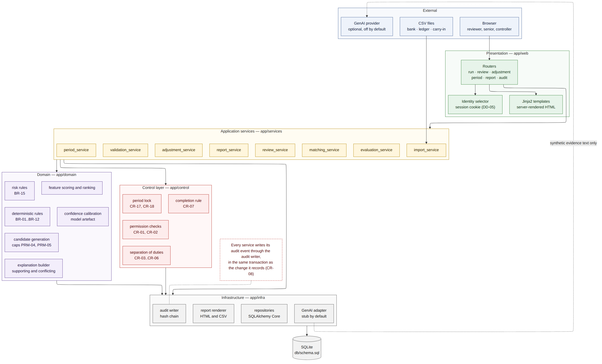

# AI-Assisted Bank Reconciliation

A human-supervised bank reconciliation system. It matches a month of bank transactions to the general ledger, proposes how to treat everything that does not match, and requires a recorded human decision for every item. Every system and human action is written to a hash-chained audit log, and the period closes on a full bank-to-book reconciliation statement.

> **AI recommends. Humans authorize. The system documents both.**

## Status

Feature-complete and tested: **224 automated tests passing**. Matching evaluation and the release guides are in progress; the first release will be tagged `v1.0.0`.

## What It Does

| Step | What happens | Who decides |
|---|---|---|
| Import and validate | Three CSV files (bank statement, ledger cash detail, prior-period carry-in items) plus control totals. 23 validation tests; originals kept beside normalized values | System; a file-level failure blocks matching |
| Match | Deterministic rules settle exact matches first; a scoring layer proposes the rest, including one-to-many groups, with calibrated confidence and the evidence for and against | System proposes |
| Classify and route | Exceptions (fees, interest, outstanding checks, deposits in transit, duplicates, unexplained items) get a category, a rule-based risk level and a queue | System proposes |
| Review | Every item: approve, select another candidate, reject, escalate, leave unresolved, or pair by hand. Exact matches can be approved as a batch, one record per item | Staff and Senior Accountants |
| Adjust | Proposed correcting entries for fees, interest and missing entries, approved by someone other than the preparer. **Never posted** | Senior Accountant or Controller |
| Report and close | 13 reports in HTML and CSV with content hashes; a report check confirms each approved item before it counts as reconciled; sign-off records the statement and the audit chain head, then locks the period | Controller |
| Reopen | Requested with a reason, approved by a different person; a new sign-off is needed to close again | Accountant requests, Controller approves |

On the included August 2026 dataset, the scoring layer raises recall from **0.69** (rules only) to **0.98** with **no incorrect match**, and a complete review closes at an unresolved difference of **-$9,392.35**, exactly the difference the dataset was built with.

## Architecture



| Layer | Package | Responsibility |
|---|---|---|
| Presentation | `app/web` | Reviewer interface: routes, view functions, templates |
| Services | `app/services` | One service per workflow; owns every transaction |
| Control | `app/control` | Permissions, separation of duties, state models, period lock, the six-condition reconciliation rule |
| Domain | `app/domain` | Rules, candidates, scoring, calibration, risk, explanations, statement arithmetic. No input or output |
| Infrastructure | `app/infra` | Repositories (all SQL), audit chain, report rendering, optional prose adapter |
| Storage | `db/schema.sql` | SQLite schema; append-only triggers and period locks enforce the controls a second time |

## Tech Stack

| Tool | Used for |
|---|---|
| Python 3.11+ | Everything; the standard library covers CSV, hashing, JSON and SQLite |
| SQLite (`sqlite3`) | Storage, with triggers and CHECK constraints as a control layer |
| scikit-learn | Confidence calibration only (isotonic regression), never matching decisions |
| FastAPI, Uvicorn, Jinja2 | Server-rendered reviewer interface and report rendering |
| pytest, httpx | Tests, including HTTP routes without a running server |

No ORM, no front-end framework, no cloud service and no paid API. Generative AI is optional, off by default, and limited to restating evidence as prose.

## Setup

Requires Python 3.11 or later.

```bash
git clone https://github.com/uday269/bank_reconciliation.git
cd bank_reconciliation
python3 -m pip install -r requirements.txt
python3 -m app.cli init
```

`init` creates `reconciliation.db` and the reference data: chart of accounts, the bank account, and four identities.

## Usage

### Reviewer interface

```bash
python3 -m app.cli serve
```

Open <http://127.0.0.1:8000> and choose who you are acting as from the selector at the top right.

| Identity | Role | Typical work |
|---|---|---|
| Maya Castillo, Ethan Brooks | Staff Accountant | Import, review queues, batch exact matches, propose adjustments |
| Priya Raman | Senior Accountant | High-risk and escalated items, approve adjustments |
| Daniel Okafor | Controller | Sign off and lock the period, decide reopening |

A complete reconciliation:

1. **New run** (Maya): create the August run, upload the four files from `data/august_2026/`, then **Validate and match**.
2. **Review** (Maya, Ethan): batch-approve CAT-01; work through CAT-02 to CAT-04. Each item shows every candidate, the supporting and conflicting evidence, and why any action is blocked.
3. **Senior queue** (Priya): decide high-risk and escalated items; pair missed groups by hand; approve the adjustments.
4. **Reports** (anyone): generate the package. The report check moves approved items to reconciled.
5. **Close** (Daniel): review the statement and the six close conditions, explain the difference, sign off.

Identity is selected, not authenticated. Every decision is still attributed and checked against the role and separation-of-duties rules.

### Command line

| Command | Purpose |
|---|---|
| `python3 -m app.cli init` | Create the database and reference data |
| `python3 -m app.cli run` | Import, validate and match `data/august_2026` (or `--data DIR`) |
| `python3 -m app.cli status` | Run status, queue counts and audit chain result |
| `python3 -m app.cli report` | Generate the report package into `reports/run_<id>/` |
| `python3 -m app.cli verify` | Recompute the audit hash chain |
| `python3 -m app.cli serve` | Start the reviewer interface |
| `python3 -m app.cli reset --force` | Delete the database and start again |

Decisions, adjustments, sign-off and reopening are made only in the interface, so each has one path, and it goes through the controls.

### Tests

```bash
python3 -m pytest -q
```

## Controls at a Glance

| Control | How it is enforced |
|---|---|
| Every item needs a recorded human decision | No automatic approval exists; confidence only orders the queues |
| High-risk and escalated items need a senior | Role check, and an independence check against whoever reviewed or escalated the item |
| Separation of duties | Adjustment preparer ≠ approver; reopen requester ≠ approver; signer ≠ sole reviewer |
| Reconciled means all six conditions hold | Validated, proposed, approved, evidence linked, audited, and confirmed in the report |
| Evidence is never edited | Append-only database triggers plus a SHA-256 hash chain; corrections are new events |
| A closed period stays closed | Service checks and database triggers; only an approved reopening unlocks it |
| Refusals leave evidence | Every blocked action is recorded with the rule that blocked it |

**Stated limit:** triggers stop changes made through this application. Anyone holding the database file could rebuild it, chain included; the chain head recorded at sign-off and in the exported package, kept outside the database, is what makes that detectable. This is weaker than write-once storage.

## Data

Synthetic and generated from fixed seeds, so every run is identical.

| Dataset | Seed | Transactions | Use |
|---|---|---|---|
| `data/august_2026` | 20260801 | 1,240 | Every demonstration, test and reported metric |
| `data/july_2026_calibration` | 20260701 | 988 | Fitting the confidence calibrator only |

```bash
python3 scripts/generate_dataset.py                        # August 2026
python3 scripts/generate_dataset.py --profile calibration  # July 2026
python3 scripts/fit_calibration.py                         # refit models/calibration.json
```

`ground_truth.csv` holds the correct answer for every item. Only the tests and benchmarks read it; the application never does.

## Project Structure

```
bank_reconciliation/
├── app/
│   ├── cli.py            Command line
│   ├── config.py         Configuration and the per-run parameter snapshot
│   ├── web/              Reviewer interface: routes, views, templates, stylesheet
│   ├── services/         Import, validation, matching, review, adjustments, period, reports, prose
│   ├── control/          Permissions, separation of duties, state models, period lock, completion rule
│   ├── domain/           Rules, candidates, scoring, calibration, risk, explanations, statement
│   └── infra/            Database, repositories, audit chain, report rendering, prose adapter
├── config/default.toml   Parameters; local overrides go in config/local.toml (not committed)
├── data/                 Seeded datasets with ground truth
├── db/schema.sql         Schema, constraints, triggers, indexes
├── docs/                 Project documents (Markdown and Word) and diagrams
├── guides/               User-facing guides (Markdown and Word)
├── models/               Fitted calibration artefact
├── reports/              Benchmarks; generated packages go in reports/run_<id>/ (not committed)
├── scripts/              Dataset generation, calibration fitting, benchmarks
└── tests/                224 tests: unit, integration, control, scenario, reproducibility
```

## Documents

| ID | Document | Markdown | Word |
|---|---|---|---|
| DOC-01 | Project Proposal | [md](docs/markdown/01_project_proposal.md) | [docx](docs/word-files/01_project_proposal.docx) |
| DOC-02 | Requirements Specification | [md](docs/markdown/02_requirements_specification.md) | [docx](docs/word-files/02_requirements_specification.docx) |
| DOC-03 | Systems Analysis | [md](docs/markdown/03_systems_analysis.md) | [docx](docs/word-files/03_systems_analysis.docx) |
| DOC-04 | Data Specification | [md](docs/markdown/04_data_specification.md) | [docx](docs/word-files/04_data_specification.docx) |
| DOC-05 | System Design | [md](docs/markdown/05_system_design.md) | [docx](docs/word-files/05_system_design.docx) |
| DOC-06 | Test Plan and Results | [md](docs/markdown/06_test_plan_and_results.md) | [docx](docs/word-files/06_test_plan_and_results.docx) |
| — | Reviewer Interface Wireframes | [md](docs/markdown/reviewer_interface_wireframes.md) | [docx](docs/word-files/reviewer_interface_wireframes.docx) |

Benchmarks: [rules only](reports/baseline_benchmark.md) · [rules plus scoring](reports/hybrid_benchmark.md)

## Scope

| Item | Value |
|---|---|
| Organization | Bonneville Provisions Co. (fictional) |
| Account | Lone Peak Commercial Bank, Operating Checking ending 7310 (fictional) |
| Period | August 2026, one account |
| Import format | CSV only |
| Data | Synthetic only |
