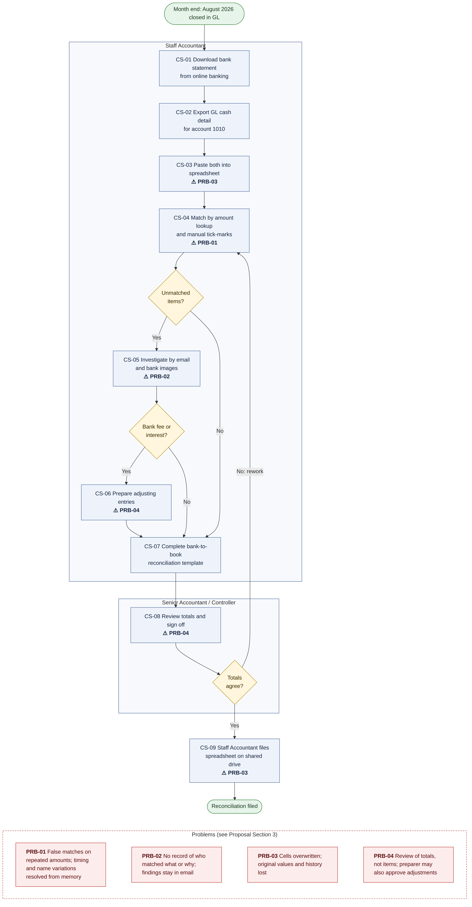

# Project Proposal — AI-Assisted Bank Reconciliation

## 1. Purpose

This document defines the business problem, stakeholders, scope, assumptions, risks and success criteria for an AI-assisted bank reconciliation system. Once approved, it is the baseline against which all later requirements, design and evaluation work is traced.

## 2. Business Context

| Attribute | Value |
|-----------------|----------------------------------------------------------------|
| Organization | Bonneville Provisions Co. (fictional) |
| Business | Wholesale distributor of specialty foods to restaurants and grocers in Utah and Idaho |
| Headquarters | Salt Lake City, Utah |
| Bank | Lone Peak Commercial Bank (fictional) |
| Account in scope | Operating Checking, account ending 7310, USD |
| General ledger account | 1010 Cash – Operating |
| Reconciliation period | August 2026 (1–31 August), 21 business days |
| Monthly volume in scope | Approximately 1,240 bank and ledger transactions combined |
| Transaction mix | Customer receipts (ACH, check, card settlement), vendor payments (check, ACH), payroll, bank fees, interest |

## 3. Problem Statement

The monthly reconciliation of the operating account is performed in a spreadsheet. The process works, but it has four structural weaknesses:

| ID | Problem | Consequence |
|---------|----------------------------|------------------------------------------------|
| PRB-01 | Matching is done by amount lookups and manual tick-marks | Repeated amounts produce false matches; timing differences and abbreviated bank descriptions are resolved by memory |
| PRB-02 | There is no record of who matched what, when, or why | Matches cannot be traced or re-performed during review or audit |
| PRB-03 | Spreadsheet cells are overwritten | Corrections destroy the original value; history cannot be reconstructed |
| PRB-04 | Senior review is a sign-off on totals | Individual high-value or unusual items are not visibly reviewed; escalation depends on the preparer's judgment |

Most of the effort goes to routine one-to-one matches. The judgment-heavy items are timing differences, grouped deposits, bank-originated charges, duplicates and unexplained items. They receive the same undifferentiated treatment as the routine work.

## 4. Objective and Central Question

**Objective:** Design, build and evaluate a human-supervised system that recommends bank-to-ledger matches and exception treatments, while preserving accountability, evidence and control.

**Central question:** To what extent can a hybrid rules and AI system reduce manual reconciliation effort without increasing the risk of incorrect matches?

The answer is produced in DOC-07 Evaluation Report by comparing the hybrid system against a rules-only baseline on the same labeled dataset.

## 5. Success Criteria

Control criteria are absolute and must be met. Evaluation criteria require an evidenced answer, not a predetermined result.

| ID | Type | Criterion |
|--------|------------------|--------------------------------------------------------------|
| SC-01 | Control | 100% of reconciliation items carry a recorded human approval before being reported as reconciled |
| SC-02 | Control | No item is reported as reconciled unless all six completion conditions are satisfied; this is enforced in code and verified by tests |
| SC-03 | Control | 100% of audit events contain every required minimum field (audit completeness) |
| SC-04 | Control | The audit hash chain verifies end to end for the demonstration run, and any altered event is detected |
| SC-05 | Control | Separation-of-duties rules block every prohibited combination in testing |
| SC-06 | Reproducibility | The same seed produces identical data, recommendations, metrics and reports on every run |
| SC-07 | Coverage | All eight matching and exception scenarios (SCN-01..08) are present in the dataset and handled end to end |
| SC-08 | Evaluation | Precision, recall, false automatic match rate, review rate, approval rate and exception accuracy are reported for both rules-only and hybrid, with *n* beside every rate |
| SC-09 | Evaluation | The central question is answered with evidence, including error analysis and stated limitations |
| SC-10 | Documentation | Every requirement, rule, scenario and test carries a stable ID traceable across all documents |

## 6. Stakeholders

### 6.1 Business stakeholders (fictional organization)

| Role | Name | Interest | Involvement |
|-------------|-----------------|-----------------------|--------------------------------------|
| Staff Accountant | Maya Castillo | Faster matching; clear evidence for each item | Primary reviewer; approves matches and exceptions; prepares adjustments |
| Staff Accountant | Ethan Brooks | Same as above | Primary reviewer; provides second-person coverage for separation of duties |
| Senior Accountant | Priya Raman | Visibility of high-risk items; defensible decisions | Approves escalated and high-risk items; approves adjustments |
| Controller | Daniel Okafor | Reliable month-end close; audit readiness | Signs off the reconciliation; closes and reopens the period |
| External Auditor | Harrow & Vance CPAs (fictional) | Traceable, re-performable evidence | Consumer of the report package and audit log |
| System | Reconciliation engine | — | Performs validation, normalization, matching and scoring; writes system audit events |

### 6.2 Delivery stakeholders

| Role | Name | Responsibility |
|---------------|----------|-------------------------------------------------------|
| Project Sponsor | — | Approves scope and design decisions; weekly progress review; final authority on scope |
| Lead Analyst and Developer | Uday Gunturu | Analysis, design, build, testing, documentation, release |

## 7. Scope

### 7.1 In scope

| Area | Included |
|------------------|-------------------------------------------------------------------|
| Data intake | CSV import of the bank statement and GL cash detail; structure, field, record-count, control-total and duplicate validation |
| Normalization | Dates, amounts, descriptions, payee names and references, with original values retained |
| Matching | Deterministic exact rules; AI-assisted candidate generation, scoring and ranking for one-to-one, one-to-many and many-to-one matches |
| Recommendations | Confidence score, rule-based risk level, and plain-language explanation with supporting and conflicting evidence |
| Exceptions | Classification of unmatched items with a recommended next action |
| Human control | Review queues, approve / reject / modify / escalate / leave unresolved, senior approval, separation of duties |
| Adjustments | Proposed and approved adjustment records only |
| Audit | Append-only, hash-chained audit log covering every system and human action |
| Period control | Period close with sign-off and lock; controlled reopening |
| Reporting | Ten process reports and the reconciliation report package (13 distinct reports, RPT-01..13) |
| Evaluation | Labeled synthetic dataset; rules-only baseline versus hybrid comparison |

### 7.2 Out of scope — deliberate no-ops

| Item | Reason |
|----------------------------|----------------------------------------------------|
| Posting journal entries to any accounting system | The system proposes and records adjustments; posting remains a human action outside the system |
| Bank file formats MT940, BAI2, OFX | Format parsing adds no control or matching value; CSV is sufficient (DD-08) |
| Real authentication and single sign-on | A user selector demonstrates role and separation-of-duties enforcement without credential handling (DD-05) |
| Write-once (WORM) storage | Replaced by database triggers and a hash chain with an external anchor; the limitation is stated (DD-06) |
| Multiple accounts, currencies or periods per run | One account and one month is enough to exercise every scenario |
| Live bank feeds or APIs | Not required to demonstrate the workflow; avoids handling real credentials |
| Retraining from individual reviewer decisions | Model changes require a separately validated dataset and approval |
| Generative AI producing scores, confidence, risk or decisions | GenAI is limited to optional explanatory prose (DD-10) |
| Real banking or customer data | Synthetic data only |
| Native PDF report generation | Reports are produced as HTML and CSV; PDF is available through the browser's print function (pending sponsor confirmation) |

## 8. Solution Overview

| Layer | Responsibility | Nature |
|----------------|------------------------------------------|-------------------------|
| Intake and validation | Import, validate, record control totals and file hashes | Deterministic |
| Normalization | Standardize fields and keep originals | Deterministic |
| Rules | Exact matches and known bank-originated items | Deterministic |
| Candidate generation | Limit the candidates considered per transaction, including capped group search | Deterministic |
| Scoring and ranking | Date distance, amount, text, reference and relationship-type features | Probabilistic, with calibrated confidence |
| Risk | Amount, novelty, duplication and policy flags | Deterministic, inspectable |
| Explanation | Supporting and conflicting evidence in plain language | Deterministic; optional GenAI prose, labeled as AI-generated |
| Review and approval | Queues, decisions, escalation, separation of duties | Human |
| Audit and reporting | Hash-chained events; reproducible reports | Deterministic |

Planned technology: Python, FastAPI, Jinja2, SQLAlchemy and SQLite, running locally on macOS. Each additional library is justified in DOC-05.

## 9. Current-State Process

{height=6.2in}

| Step | Activity | Performed by | Pain point |
|--------|-----------------------------|-------------|-------------------------------------|
| CS-01 | Download the bank statement from online banking | Staff Accountant | No record of file version or control totals |
| CS-02 | Export GL cash detail for account 1010 | Staff Accountant | Export date and filters are not recorded |
| CS-03 | Paste both into the reconciliation spreadsheet | Staff Accountant | Original values are overwritten during clean-up |
| CS-04 | Match by amount lookup and manual tick-marks | Staff Accountant | False matches on repeated amounts; timing gaps and name variations handled from memory (PRB-01) |
| CS-05 | Investigate unmatched items by email and bank images | Staff Accountant | Findings live in email; there is no link to the item (PRB-02) |
| CS-06 | Prepare adjusting entries for fees and interest | Staff Accountant | Preparer may also be the approver |
| CS-07 | Complete the bank-to-book reconciliation template | Staff Accountant | Manual carry-forward of outstanding items from the prior month |
| CS-08 | Senior review and sign-off | Senior Accountant / Controller | Review of totals, not items (PRB-04) |
| CS-09 | File the spreadsheet on the shared drive | Staff Accountant | Later edits are possible without a trace (PRB-03) |

## 10. Assumptions

| ID | Assumption |
|---------|-------------------------------------------------------------------------|
| ASM-01 | One USD operating account and one GL cash account (1010) are reconciled per run |
| ASM-02 | The period is one calendar month; business days follow the US federal holiday calendar |
| ASM-03 | All data is synthetic, generated from a fixed seed; no real banking or customer data is used |
| ASM-04 | The bank CSV provides a running balance; opening and closing balances are derivable from the statement |
| ASM-05 | The prior month's reconciliation is accepted as correct; its outstanding items carry into the current period |
| ASM-06 | Amounts are stored as integer cents; there is no foreign currency |
| ASM-07 | Users select their identity from a list; they are assumed to act in good faith |
| ASM-08 | The system runs locally for a single organization on one machine |
| ASM-09 | Thresholds are configurable: senior approval at $10,000 or more, a ±3 business-day timing window, and outstanding checks clearing within 45 days |
| ASM-10 | Group matches are limited to 15 candidates and 4 members per group; items beyond the limit are raised as exceptions |

## 11. Constraints

| ID | Constraint |
|---------|-------------------------------------------------------------------------|
| CON-01 | Only free, easily installed tools; no paid services are required |
| CON-02 | Runs on macOS with Python; no container or cloud dependency is required |
| CON-03 | The external GenAI provider is optional, off by default, and may receive synthetic data only |
| CON-04 | Every reconciliation item requires human approval; confidence prioritizes review and never replaces it |
| CON-05 | The system never posts journal entries |

## 12. Risks

Scale for likelihood (L) and impact (I): H = high, M = medium, L = low.

| ID | Risk | L | I | Mitigation |
|---------|------------------------------|----|----|------------------------------------------|
| RSK-01 | Reviewers over-trust AI recommendations and approve incorrect matches | M | H | Conflicting evidence is always shown; ranked alternatives are visible; confidence bands are labeled; no decision is preselected outside exact batches; approval rates are monitored by band |
| RSK-02 | Batch approval becomes rubber-stamping | M | H | Batches hold only exact, unflagged items; items can be pulled out of a batch; an approval record is written per item (DD-02, pending) |
| RSK-03 | Confidence calibration overfits and overstates accuracy | M | H | Separate seeded calibration and evaluation datasets; ground truth is read only by the evaluator (DD-11) |
| RSK-04 | Synthetic data is unrepresentative, so results do not transfer | H | M | Scenario mix based on common reconciliation patterns; limitation stated in DOC-07 |
| RSK-05 | Financial data is sent to an external AI service | L | H | GenAI off by default; synthetic data only; every call logged (DD-10) |
| RSK-06 | Someone with database access alters the audit history | L | H | Triggers block edits; the hash chain detects tampering; the chain-head hash is printed on the signed summary (DD-06) |
| RSK-07 | A valid group match is missed because of the search limit | M | M | The limit is disclosed; over-limit items are raised as exceptions rather than dropped (DD-07) |
| RSK-08 | Separation of duties is bypassed because the user selector has no authentication | M | M | Limitation stated; rules are enforced on the selected identity and recorded in the audit log (DD-05) |
| RSK-09 | Time-per-item cannot be measured | M | L | Reported as "not measured"; never estimated (DD-04) |
| RSK-10 | Pending sponsor decisions (DD-01, DD-02) delay dependent stages | M | M | Configurable designs; decision gates before Weeks 3 and 5 |
| RSK-11 | Scope grows beyond the planned schedule | M | M | Weekly sponsor review; out-of-scope list in Section 7.2 |

## 13. Design Decisions Baseline

The full rationale is recorded in the design decisions log in DOC-05.

| ID | Decision | Status |
|--------|-------------------------------------------------------------------|----------|
| DD-01 | False automatic match rate is reported as a hypothetical against a fixed policy defined before evaluation | Pending sponsor |
| DD-02 | Batch approval: one action writes a separate approval record per item; batches hold exact, unflagged items only | Pending sponsor |
| DD-03 | Review rate is 100% by design, with a hypothetical figure alongside | Adopted |
| DD-04 | Time per item comes from UI timestamps on a 50-item sample, two people reported separately; otherwise "not measured" | Adopted |
| DD-05 | User selector instead of login; four separation-of-duties rules enforced | Adopted |
| DD-06 | Triggers plus a SHA-256 hash chain with an external anchor; not write-once storage | Adopted |
| DD-07 | Group search capped at 15 candidates and 4 members; over-limit items raised as exceptions | Adopted |
| DD-08 | CSV import only | Adopted |
| DD-09 | Approximately 1,240 transactions in total; the generator is parameterized | Adopted |
| DD-10 | GenAI is optional, off by default, prose only, and labeled | Adopted |
| DD-11 | Machine learning is limited to confidence calibration; risk is rule-based | Adopted |
| DD-12 | Full bank-to-book reconciliation statement, including prior-period carry-in items | Adopted |

## 14. Deliverables

| ID | Deliverable | Location |
|-------------|------------------------------------------------------|------------------|
| DOC-01 | Project Proposal | `docs/` |
| DOC-02 | Requirements Specification, with traceability matrix | `docs/` |
| DOC-03 | Systems Analysis | `docs/` |
| DOC-04 | Data Specification, with synthetic dataset and ground truth | `docs/`, `data/` |
| DOC-05 | System Design, with design decisions log | `docs/` |
| DOC-06 | Test Plan and Results | `docs/` |
| DOC-07 | Evaluation Report | `docs/` |
| GDE-01..04 | Installation & Deployment, User, Developer, FAQ & Troubleshooting guides | `guides/` |
| APP | Working application: matching, exception classification, approvals, audit log, reports | `app/` |
| PKG | Sample reconciliation package for one complete run (RPT-01..13) | `reports/` |
| DEMO | Presentation and demonstration of one complete reconciliation run | `presentation/` |

Every document is delivered in Markdown (`markdown/`) and Word (`word-files/`).

## 15. Milestones

| Week | Milestone | Decision gate |
|---------|---------------------------------------------------|--------------------|
| 1 | Discovery and requirements approved | — |
| 2 | Systems analysis and labeled dataset complete | — |
| 3 | System design approved | DD-02 confirmed |
| 4 | Rules-only baseline and benchmark | — |
| 5 | AI recommendation layer evaluated | DD-01 confirmed |
| 6 | Controlled workflow end to end | — |
| 7 | Report package and evaluation complete | — |
| 8 | Release v1.0.0 and demonstration | — |

## 16. Items Requiring Sponsor Decision

| ID | Item | Working default |
|---------|------------------------------|--------------------------------------------|
| OPN-01 | Approve DD-01 and DD-02 as defined | As stated in Section 13 |
| OPN-02 | Format and length of written deliverables | Markdown and Word; consolidated documents |
| OPN-03 | Demonstration length | 15 minutes (10 minutes live, 5 minutes results and questions) |
| OPN-04 | Report output format | HTML and CSV; PDF through browser print |
| OPN-05 | Repository visibility and license at release | Private during build; public under MIT at v1.0.0 if approved |
| OPN-06 | Fixed completion date | 8-week plan |
