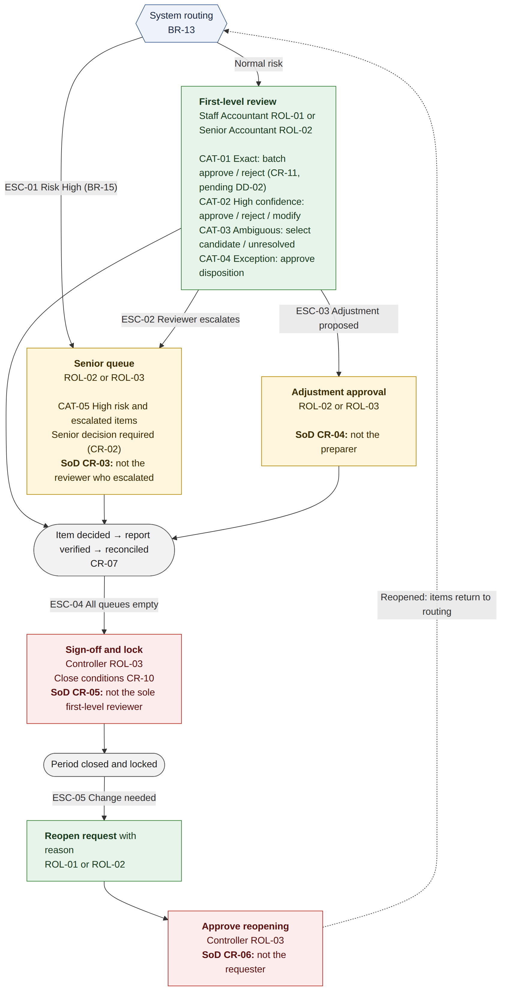

# Requirements Specification — AI-Assisted Bank Reconciliation

## 1. Purpose and Conventions

This document states what the system must do (functional requirements), how well it must do it (non-functional requirements), and the business and control rules it must enforce. Every item carries a stable ID that is reused unchanged in design, tests and evaluation.

| Prefix | Meaning | Example |
|------------|-----------------------------------------|---------------------------|
| ROL- | User role | ROL-02 Senior Accountant |
| SCN- | Matching or exception scenario | SCN-04 One to many |
| CAT- | Review category (approval queue) | CAT-05 High risk |
| EXC- | Exception category | EXC-03 Bank fee |
| PRM- | Configurable parameter | PRM-01 Senior approval amount |
| FR-xxx-nn | Functional requirement, grouped by area | FR-REV-07 |
| NFR- | Non-functional requirement | NFR-01 |
| BR- | Business rule (how items are judged) | BR-01 Exact match |
| CR- | Control rule (who may do what, and when) | CR-03 Separation of duties |
| RPT- | Report | RPT-09 Reconciliation Summary |
| NOP- | Deliberate no-op (not implemented, with reason) | NOP-01 |

All requirements are mandatory except FR-GAI (optional capability). Items marked *pending* depend on sponsor decisions DD-01 (BR-19, PRM-09, FR-EVL-02, FR-EVL-03; needed before Stage 7) and DD-02 (CR-11, FR-REV-06; needed before Stage 5). The *Source* column cites the governing brief section (§) or design decision (DD).

## 2. Roles

| ID | Role | Users (fictional) | Responsibilities |
|---------|-------------|-----------------|-----------------------------------------------------|
| ROL-01 | Staff Accountant | Maya Castillo, Ethan Brooks | Import data, run matching, first-level review, escalate, prepare adjustments, request reopening |
| ROL-02 | Senior Accountant | Priya Raman | Approve escalated and high-risk items, approve adjustments, request reopening |
| ROL-03 | Controller | Daniel Okafor | Approve escalated and high-risk items, approve adjustments, sign off and close the period, approve reopening |
| ROL-04 | System | Reconciliation engine | Validate, normalize, match, score, classify, route, verify reports, write system audit events |

Users select their identity from a list (DD-05). Separation-of-duties rules are enforced on the selected identity and recorded in the audit log.

### 2.1 Permission Matrix

✓ = permitted, — = not permitted, SoD = permitted subject to a separation-of-duties rule.

| Action | ROL-01 | ROL-02 | ROL-03 | ROL-04 |
|--------------------------------|---------|----------|-----------|-------------------|
| Import files and start a run | ✓ | ✓ | — | — |
| Validate, normalize, match, score, classify | — | — | — | ✓ |
| Decide CAT-01..04 items (first-level review) | ✓ | ✓ | — | — |
| Escalate an item | ✓ | ✓ | — | ✓ (by rule) |
| Decide CAT-05 and escalated items | — | SoD (CR-03) | SoD (CR-03) | — |
| Propose an adjustment | ✓ | ✓ | — | ✓ (bank-originated items) |
| Approve or reject an adjustment | — | SoD (CR-04) | SoD (CR-04) | — |
| Sign off and close the period | — | — | SoD (CR-05) | — |
| Request reopening | ✓ | ✓ | — | — |
| Approve reopening | — | — | SoD (CR-06) | — |
| View items, reports and audit log | ✓ | ✓ | ✓ | — |

## 3. Scenarios, Categories and Parameters

### 3.1 Matching and Exception Scenarios (§5)

| ID | Scenario | Illustrative condition | Expected treatment | Typical category |
|---------|------------------|--------------------------------|------------------------|-----------|
| SCN-01 | Exact match | Amount, reference and date agree | Recommend batch approval | CAT-01 |
| SCN-02 | Timing difference | Same amount, posting dates differ within PRM-02 | Propose likely match and explain the timing | CAT-02 / CAT-03 |
| SCN-03 | Name variation | Abbreviated bank description resembles the ledger name | Text similarity with supporting evidence | CAT-02 / CAT-03 |
| SCN-04 | One to many | One bank deposit equals several ledger receipts | Present the proposed group for approval | CAT-02 / CAT-03 |
| SCN-05 | Many to one | Several bank transactions equal one ledger entry | Present the proposed group for approval | CAT-02 / CAT-03 |
| SCN-06 | Bank-originated item | Fee or interest with no ledger entry | Recommend classification and adjustment | CAT-04 |
| SCN-07 | Duplicate | Similar amount, date and description appear more than once | Flag for investigation | CAT-05 |
| SCN-08 | Unexplained item | No credible ledger candidate exists | Escalate and keep unresolved | CAT-05 |

### 3.2 Review Categories (§6)

| ID | Category | System action | Required human action | Approver |
|---------|-------------|----------------------------------|------------------------|------------|
| CAT-01 | Exact | Recommend reconciliation; group into a review batch | Approve or reject the batch | ROL-01/02 |
| CAT-02 | High confidence | Show proposed match, explanation and evidence | Approve, reject or modify | ROL-01/02 |
| CAT-03 | Ambiguous | Rank candidates and show trade-offs | Select a candidate or leave unresolved | ROL-01/02 |
| CAT-04 | Exception | Suggest category and corrective action | Investigate and approve disposition | ROL-01/02 |
| CAT-05 | High risk | Escalate on amount, novelty, duplication or policy | Obtain senior approval | ROL-02/03 |

### 3.3 Exception Categories (§8)

| ID | Category | Side | Recommended next action |
|---------|---------------|---------|---------------------------------------------------|
| EXC-01 | Outstanding check | Ledger | Carry forward as reconciling item; investigate if older than PRM-03 |
| EXC-02 | Deposit in transit | Ledger | Carry forward as reconciling item; investigate if older than PRM-10 |
| EXC-03 | Bank fee | Bank | Propose adjustment (expense debit, cash credit) |
| EXC-04 | Bank interest | Bank | Propose adjustment (cash debit, income credit) |
| EXC-05 | Duplicate | Either | Investigate; confirm or dismiss the duplicate |
| EXC-06 | Missing ledger entry | Bank | Identify the source; propose adjustment |
| EXC-07 | Unexplained item | Either | Escalate; keep unresolved until explained |
| EXC-08 | Possible group beyond search limit | Either | Manual investigation (DD-07) |

### 3.4 Configurable Parameters

Defaults apply to the demonstration run. Every run records the parameter values it used.

| ID | Parameter | Default | Source |
|---------|-----------------------------------|----------------------|----------------|
| PRM-01 | Senior approval amount | $10,000.00 (1,000,000 cents) | G2 |
| PRM-02 | Timing window | ±3 business days | G3 |
| PRM-03 | Outstanding check stale after | 45 calendar days | G3 |
| PRM-04 | Group candidate cap | 15 | DD-07 |
| PRM-05 | Group member cap | 4 | DD-07 |
| PRM-06 | High confidence band, lower bound | 0.90 | Confirmed in Stage 7 |
| PRM-07 | Low confidence band, upper bound (exclusive) | 0.70 | Confirmed in Stage 7 |
| PRM-08 | Minimum margin between first and second candidate for CAT-02 | 0.15 | Confirmed in Stage 7 |
| PRM-09 | Hypothetical auto-accept threshold *T* | Set on calibration data only | DD-01 (pending) |
| PRM-10 | Deposit in transit stale after | 5 business days | New default |

## 4. Functional Requirements

### 4.1 Import (FR-IMP)

| ID | Requirement | Source |
|------------|----------------------------------------------------------------|---------|
| FR-IMP-01 | Import the bank statement as CSV | §4, DD-08 |
| FR-IMP-02 | Import GL cash detail for account 1010 as CSV, with period opening and closing balances | §4, DD-12 |
| FR-IMP-03 | Import the prior-period outstanding items list (carry-in) as CSV | DD-12 |
| FR-IMP-04 | For each file record source name, uploader, UTC timestamp, row count, control totals (debits, credits, net) and SHA-256 file hash | §7 |
| FR-IMP-05 | Reject a file whose hash was already imported into the same run | §4 |
| FR-IMP-06 | Assign a unique reconciliation run ID covering one account and one period | §7 |

### 4.2 Validation (FR-VAL)

| ID | Requirement | Source |
|------------|-----------------------------------------------------------------|---------|
| FR-VAL-01 | Check file structure: required columns present, header recognized | §4 |
| FR-VAL-02 | Check required fields are present and typed (ISO date, numeric amount, known debit/credit indicator) | §4, §9 |
| FR-VAL-03 | Check record counts and control totals: opening balance + credits − debits = closing balance, for bank and GL | §4 |
| FR-VAL-04 | Detect duplicate transaction IDs within a file (rejected) and possible duplicate transactions with different IDs (flagged, not rejected) | §4, §5 |
| FR-VAL-05 | Flag transactions dated outside the period | §4 |
| FR-VAL-06 | Record every test performed, failures, exclusions and duplicate findings | §7 |
| FR-VAL-07 | Block matching when any file-level check fails; exclude and report failing rows otherwise | §14 |

### 4.3 Normalization (FR-NRM)

| ID | Requirement | Source |
|------------|---------------------------------------------------------------|---------|
| FR-NRM-01 | Normalize dates to ISO 8601 and amounts to signed integer cents with direction | §4 |
| FR-NRM-02 | Normalize descriptions (case, punctuation, whitespace, known abbreviations) | §4 |
| FR-NRM-03 | Extract payee or counterparty names from bank descriptions | §4 |
| FR-NRM-04 | Normalize references (prefixes such as "CHK#", leading zeros) | §4 |
| FR-NRM-05 | Retain every original value beside its normalized value, with the transformation rule name | §4, §7 |

### 4.4 Deterministic Matching (FR-MAT)

| ID | Requirement | Source |
|------------|--------------------------------------------------------------|---------|
| FR-MAT-01 | Identify exact one-to-one matches under BR-01 and BR-02 | §4, §10 |
| FR-MAT-02 | Identify bank-originated items under BR-06 | §10 |
| FR-MAT-03 | Match current-period bank items to carry-in outstanding items under BR-11 | DD-12 |
| FR-MAT-04 | Record rule name and version, linked records, result and timestamp for every rule outcome | §7 |

### 4.5 AI Recommendations (FR-AI)

| ID | Requirement | Source |
|-----------|-----------------------------------------------------------------|---------|
| FR-AI-01 | Generate one-to-one candidates for each unmatched item, limited by direction, date window (PRM-02) and amount | §4, §10 |
| FR-AI-02 | Generate one-to-many and many-to-one candidate groups under BR-04 and BR-05 | §4, §5 |
| FR-AI-03 | Classify items whose group search exceeds PRM-04 or PRM-05 as EXC-08 instead of dropping them | DD-07 |
| FR-AI-04 | Score candidates on date distance, amount similarity, text similarity, reference similarity and relationship type | §10 |
| FR-AI-05 | Rank candidates and convert the top score to a calibrated confidence between 0 and 1 | §4, DD-11 |
| FR-AI-06 | Produce a plain-language explanation listing supporting evidence and all conflicting evidence | §4, §6 |
| FR-AI-07 | Record model version, feature values, all candidate scores, confidence, risk and explanation for every recommendation | §7 |
| FR-AI-08 | Produce identical recommendations for identical inputs, parameters and model version | NFR-01 |

### 4.6 Risk and Exceptions (FR-RSK, FR-EXC)

| ID | Requirement | Source |
|-------------|---------------------------------------------------------|----------|
| FR-RSK-01 | Assign a risk level (Low, Medium, High) by the rules in BR-15 and show which rules triggered | §4, DD-11 |
| FR-EXC-01 | Classify every unmatched item into EXC-01..08 | §4 |
| FR-EXC-02 | Recommend the next action for each exception (§3.3) | §4 |
| FR-EXC-03 | Link supporting records to each exception | §7 |

### 4.7 Review and Approval (FR-REV)

| ID | Requirement | Source |
|------------|---------------------------------------------------------------|------------|
| FR-REV-01 | Route every item to one review category under BR-13 | §4, §6 |
| FR-REV-02 | Order each queue by risk (High first), then by confidence (lowest first) | §6 |
| FR-REV-03 | Show, for each item: bank transaction and source evidence; proposed match or ranked candidates; confidence and risk; supporting and conflicting evidence; suggested exception category and corrective action; decision controls; comment field and reviewer identity; item history | §6, §12 |
| FR-REV-04 | Offer the actions permitted for the item's category: approve, reject, modify, escalate, mark unresolved | §6 |
| FR-REV-05 | Record reviewer identity, decision, comment, UTC timestamp and status change for every decision | §6, §7 |
| FR-REV-06 | Batch-approve CAT-01 items under CR-11 | §5, DD-02 (pending) |
| FR-REV-07 | Record *modify* as a new decision that keeps the original recommendation | §7 |
| FR-REV-08 | Route escalated items to the senior queue | §6 |
| FR-REV-09 | Show every ranked candidate, not only the top one | §15, §16 |
| FR-REV-10 | Never preselect a decision; approval of a non-exact item requires opening its detail view | §15 |
| FR-REV-11 | Record the time an item's detail is opened and the time of the decision | DD-04 |

### 4.8 Adjustments (FR-ADJ)

| ID | Requirement | Source |
|------------|----------------------------------------------------------------|---------|
| FR-ADJ-01 | Propose an adjustment with amount, debit account, credit account, rationale, linked items and evidence | §7, §8 |
| FR-ADJ-02 | Approve or reject adjustments under CR-04 | §7 |
| FR-ADJ-03 | Keep rejected adjustments on record | §7 |
| FR-ADJ-04 | Present approved adjustments in the Adjustment Report only; never post them (CR-12) | §16 |

### 4.9 Audit (FR-AUD)

| ID | Requirement | Source |
|------------|----------------------------------------------------------------|---------|
| FR-AUD-01 | Write an audit event for every system and human action | §4, §7 |
| FR-AUD-02 | Include in every event: event ID; run ID; bank account; period; transaction IDs; process; UTC timestamp; user or system identity; original and revised values; rule name or model version; candidate scores, confidence, risk and explanation; decision, comments and approval status; supporting document references; previous and new status | §7 |
| FR-AUD-03 | Prevent update and delete of audit events at the database level | §7, DD-06 |
| FR-AUD-04 | Chain each event to the previous one with a SHA-256 hash | DD-06 |
| FR-AUD-05 | Provide a verification that recomputes the chain and reports the first broken event | DD-06 |
| FR-AUD-06 | Record corrections as new events that reference the corrected event | §7 |
| FR-AUD-07 | Print the chain-head hash on the signed Reconciliation Summary | DD-06 |

### 4.10 Period Control (FR-PER)

| ID | Requirement | Source |
|------------|--------------------------------------------------------------|---------|
| FR-PER-01 | Allow close only when CR-10 conditions are met | §4 |
| FR-PER-02 | Record sign-off, final totals, unresolved items and a lock event at close | §7 |
| FR-PER-03 | Block all imports, decisions and adjustments in a locked period | §7 |
| FR-PER-04 | Reopen a period on request with reason and approval (CR-06), recording original state, revised state, requester and approver | §7 |
| FR-PER-05 | Require a new sign-off to close a reopened period | §7 |

### 4.11 Reports (FR-RPT)

| ID | Requirement | Source |
|------------|-----------------------------------------------------------------|---------|
| FR-RPT-01 | Produce RPT-01..13 as defined in §6 of this document | §7, §8 |
| FR-RPT-02 | Assemble the Section 8 package from RPT-09, 02, 11, 06, 07, 08, 12 and 13, with the remaining reports as appendices | §8 |
| FR-RPT-03 | Output each report as HTML (printable to PDF) and CSV | OPN-04 |
| FR-RPT-04 | Produce identical report content from identical inputs; only the generation timestamp may differ | NFR-01 |
| FR-RPT-05 | Verify that every approved item appears correctly in the reconciliation report before marking it reconciled | §14, G4 |

### 4.12 Evaluation (FR-EVL)

| ID | Requirement | Source |
|------------|---------------------------------------------------------------|------------|
| FR-EVL-01 | Report precision and recall overall and per scenario | §11 |
| FR-EVL-02 | Report the false automatic match rate as a hypothetical under BR-19 | §11, DD-01 (pending) |
| FR-EVL-03 | Report review rate as 100% by design, with the hypothetical rate under BR-19 alongside | §11, DD-03 |
| FR-EVL-04 | Report approval rate and rejection rate of recommendations | §11 |
| FR-EVL-05 | Report time per item from FR-REV-11 timestamps for a stratified 50-item sample per person, or "not measured" | §11, DD-04 |
| FR-EVL-06 | Report exception classification accuracy | §11 |
| FR-EVL-07 | Report audit completeness: share of events containing every FR-AUD-02 field | §11 |
| FR-EVL-08 | Report results by confidence band | §8, §11 |
| FR-EVL-09 | Run rules-only and hybrid on the same evaluation dataset and compare them | §12 |
| FR-EVL-10 | Show the sample size *n* beside every rate | G8 |
| FR-EVL-11 | Use separate seeded calibration and evaluation datasets; only the evaluator reads ground truth | DD-11 |

### 4.13 Generative AI (FR-GAI) — optional

| ID | Requirement | Source |
|------------|---------------------------------------------------------------|---------|
| FR-GAI-01 | Offer optional AI-written explanation prose, off by default | §10, DD-10 |
| FR-GAI-02 | Label generated prose as AI-generated and show it beside, never instead of, the deterministic explanation | DD-10 |
| FR-GAI-03 | Use a provider-neutral adapter with an offline deterministic stub as default | DD-10 |
| FR-GAI-04 | Log every call's inputs, outputs, provider, model and version | §10 |

## 5. Non-Functional Requirements

| ID | Category | Requirement | Source |
|---------|------------------|-------------------------------------------------------|--------------|
| NFR-01 | Reproducibility | The same seed, inputs, parameters and model version produce identical data, recommendations, metrics and reports | SC-06 |
| NFR-02 | Determinism | Rules use transaction business dates and the period end date, never processing time | Conventions |
| NFR-03 | Accuracy of money | All amounts are stored and computed as integer cents | Conventions |
| NFR-04 | Integrity | Audit tampering is detected by FR-AUD-05; the limit of trigger-based protection is documented | DD-06 |
| NFR-05 | Privacy | No data leaves the machine unless the optional GenAI provider is enabled, and then synthetic data only | §10, §16 |
| NFR-06 | Explainability | Every recommendation carries at least one supporting reason and lists all conflicting evidence | §6 |
| NFR-07 | Performance | A full run of the demonstration dataset (import to report package) completes within 2 minutes on a current laptop | New |
| NFR-08 | Portability | Installs on macOS with free tools only; no container or cloud service required | CON-01, CON-02 |
| NFR-09 | Timekeeping | Timestamps in UTC; dates in ISO 8601 | Conventions |
| NFR-10 | Traceability | Every requirement, rule, scenario and test keeps its ID across all documents | SC-10 |
| NFR-11 | Data retention | Records are voided or deactivated, never deleted | Conventions |

## 6. Report Catalog

| ID | Report | Content | Source |
|---------|-----------------|------------------------------------------------------|-------------|
| RPT-01 | Data Import Report | Source, uploader, timestamp, row count, control totals, file hash | §7 |
| RPT-02 | Data Quality Report | Tests, failures, exclusions, duplicates; imported, rejected, duplicate and incomplete records; control total comparison | §7, §8 (Data Validation Report) |
| RPT-03 | Transformation Report | Original value, revised value, transformation rule | §7 |
| RPT-04 | Exact Match Report | Rule applied, records linked, result, timestamp | §7 |
| RPT-05 | AI Recommendation Report | Model version, candidate scores, explanation, risk, evidence | §7 |
| RPT-06 | Exception Report | Category, reason, supporting records, disposition, for EXC-01..08 | §7, §8 |
| RPT-07 | Adjustment Report | Proposed and approved entries: amounts, accounts, rationale, evidence, approvers | §7, §8 |
| RPT-08 | Approval Report | Reviewer, decision, comments, time, status change; manager sign-off, rejections, modifications, overrides | §7, §8 |
| RPT-09 | Reconciliation Summary | Bank-to-book statement (BR-17), final totals, unresolved items, approval status, sign-off, lock event, chain-head hash | §7, §8 (Executive Summary), DD-12 |
| RPT-10 | Change and Override Report | Original state, revised state, reason, requester, approver | §7 |
| RPT-11 | Match Report | Exact, AI-suggested, approved, rejected and unresolved matches with confidence and risk | §8 |
| RPT-12 | AI Performance Report | Accuracy, approval rate, rejection rate, false match rate, performance by confidence band | §8 |
| RPT-13 | Complete Audit Log | Chronological record of every event in the run, with chain verification result | §8 |

## 7. Business Rules

| ID | Rule |
|--------|-------------------------------------------------------------------------|
| BR-01 | **Exact match:** one bank item and one ledger item with equal amount in cents, same direction, equal non-empty normalized reference and the same business date |
| BR-02 | **Uniqueness:** a pair is exact only if neither item has another candidate satisfying BR-01; otherwise both go to candidate scoring |
| BR-03 | **Timing difference:** same amount and direction with business dates within PRM-02 |
| BR-04 | **Group match:** members share one direction, fall within PRM-02 of the single side's date, and sum exactly (0-cent tolerance) to the single side's amount |
| BR-05 | **Group limits:** at most PRM-04 candidates searched and PRM-05 members per group; beyond that, EXC-08 |
| BR-06 | **Bank-originated item:** a bank item identified as a fee or interest by bank transaction code or description keywords, with no ledger entry |
| BR-07 | **Suspected duplicate:** two items on the same side with equal amount, same direction, equal normalized description and dates within 1 business day, but different transaction IDs |
| BR-08 | **Outstanding check:** a ledger check payment with no bank match by the period end date |
| BR-09 | **Deposit in transit:** a ledger receipt with no bank match by the period end date |
| BR-10 | **Stale items:** an outstanding check older than PRM-03, or a deposit in transit older than PRM-10, is raised to Medium risk with the next action "investigate" |
| BR-11 | **Carry-in clearing:** a current-period bank item that matches a carry-in outstanding item clears that item; carry-in items not cleared remain reconciling items |
| BR-12 | **Missing vs unexplained:** an unmatched bank item with an identifiable counterparty or transaction type is EXC-06; with neither, EXC-07 |
| BR-13 | **Category assignment**, first match wins: High risk → CAT-05; exact → CAT-01; exception → CAT-04; top confidence ≥ PRM-06 and margin ≥ PRM-08 → CAT-02; otherwise → CAT-03 |
| BR-14 | **Confidence bands:** High ≥ PRM-06; Medium from PRM-07 up to PRM-06; Low < PRM-07. The band and the numeric value are both shown |
| BR-15 | **Risk level:** High if amount ≥ PRM-01, suspected duplicate (BR-07) or unexplained (EXC-07); Medium if counterparty not seen before, group match, or stale (BR-10); otherwise Low. The highest triggered level applies |
| BR-16 | **Next action** per exception category as listed in §3.3 |
| BR-17 | **Bank-to-book statement:** adjusted bank balance = bank ending balance + deposits in transit − outstanding checks; adjusted book balance = book ending balance + unrecorded interest and credits − unrecorded fees and debits; unresolved difference = adjusted bank balance − adjusted book balance |
| BR-18 | **Business dates:** date windows, staleness and period membership use transaction business dates and the period end date |
| BR-19 | **Hypothetical auto-accept policy** (evaluation only, never executed): CAT-01, calibrated confidence ≥ PRM-09 and no risk rule triggered |

## 8. Control Rules

| ID | Rule | Source |
|--------|-----------------------------------------------------------------|------------|
| CR-01 | Every reconciliation item requires a recorded human decision; confidence orders the queue and never replaces approval | §6 |
| CR-02 | CAT-05 and escalated items require a ROL-02 or ROL-03 decision | §6 |
| CR-03 | The senior approver of an item cannot be the user who reviewed or escalated it | DD-05 |
| CR-04 | The approver of an adjustment cannot be its preparer | DD-05 |
| CR-05 | The user who signs off the period cannot be the only user who made first-level decisions in the run | DD-05 |
| CR-06 | The approver of a reopening cannot be its requester | DD-05 |
| CR-07 | An item is **reconciled** only when all six hold: (1) source data passed validation; (2) a match or exception disposition was proposed; (3) the required human approval is recorded; (4) supporting evidence is linked; (5) the audit event was written; (6) the item appears correctly in the reconciliation report | §14 |
| CR-08 | Every action and its audit event commit together; if the audit write fails, the action is rolled back | §14 |
| CR-09 | Audit events are never updated or deleted; corrections are new events | §7 |
| CR-10 | **Close conditions:** no item awaiting decision; every escalation decided; every adjustment approved or rejected; audit chain verifies; report package generated; any non-zero unresolved difference acknowledged by the signer with a comment | §4, §8 |
| CR-11 | **Batch approval:** batches contain only CAT-01 items with Low risk; the reviewer may remove items; one approval writes one decision per item; batch rejection writes one rejection per item and requeues them | DD-02 (pending) |
| CR-12 | The system never posts journal entries | §16 |
| CR-13 | Generative AI cannot set or change a score, confidence, risk, category or decision | DD-10 |
| CR-14 | Models are never retrained from individual reviewer decisions; a new model version requires validation on the evaluation dataset and is recorded in the audit log | §16 |
| CR-15 | Low-confidence items and conflicting evidence are never hidden or filtered out by default | §16 |
| CR-16 | A comment is required to reject, modify, escalate, mark unresolved, or approve a High-risk item | §6 |
| CR-17 | Matching cannot start until all file-level validation checks pass | §14 |
| CR-18 | After close, an item's decision can change only through an approved reopening | §7 |

## 9. Approval Roles and Escalation Paths

{height=5.2in}

| Path | Trigger | From | To | Outcome |
|---------|-----------------|-------------------|--------------|--------------------------|
| ESC-01 | Risk High (BR-15) | System routing | CAT-05 senior queue (ROL-02/03) | Senior decision required (CR-02) |
| ESC-02 | Reviewer judgment | ROL-01 first-level review | Senior queue | Senior decision; CR-03 applies |
| ESC-03 | Adjustment proposed | Preparer (ROL-01/02/04) | ROL-02/03 | Approve or reject; CR-04 applies |
| ESC-04 | Period ready to close | Queues empty (CR-10) | ROL-03 | Sign-off and lock; CR-05 applies |
| ESC-05 | Change needed after close | ROL-01/02 request | ROL-03 | Reopen; CR-06 applies |

## 10. Deliberate No-Ops

| ID | Not implemented | Reason | Source |
|---------|--------------------------|----------------------------------------|---------|
| NOP-01 | Posting journal entries | Adjustments are proposed and approved records only | §16 |
| NOP-02 | MT940, BAI2, OFX import | Format parsing adds no control or matching value | DD-08 |
| NOP-03 | Authentication and single sign-on | Identity selector demonstrates role and SoD enforcement | DD-05 |
| NOP-04 | Write-once storage | Triggers and hash chain with an external anchor instead | DD-06 |
| NOP-05 | Automatic reconciliation of any item | Every item requires human approval | §6 |
| NOP-06 | Retraining from reviewer decisions | Unvalidated feedback could degrade the model silently | §16 |
| NOP-07 | GenAI scoring or decisions | Scores must be reproducible and auditable | DD-10 |
| NOP-08 | Multiple accounts, currencies or periods per run | One account and one month exercises every scenario | §9 |
| NOP-09 | Native PDF generation | HTML reports print to PDF | OPN-04 |

## 11. New Assumptions

These extend ASM-01..10 in DOC-01.

| ID | Assumption |
|---------|------------------------------------------------------------------------|
| ASM-11 | The GL export supplies opening and closing balances of account 1010 for the period |
| ASM-12 | The prior-period reconciliation supplies a list of outstanding items with IDs, dates, amounts and types |
| ASM-13 | The bank supplies a transaction type code that distinguishes fees and interest |

## 12. Traceability Matrix

| Brief § | Topic | Covered by |
|--------|-------------------------|-----------------------------------------------|
| 1 | Project challenge | DOC-01 §3; PRB-01..04 |
| 2 | Objective and central question | DOC-01 §4; FR-EVL-01..11 |
| 3 | Capability goals | FR-MAT, FR-AI, FR-REV, FR-AUD, FR-EVL groups; DOC-07 |
| 4 | Required workflow (10 steps) | Import: FR-IMP-01..03; validate: FR-VAL-01..07; normalize: FR-NRM-01..05; exact rules: FR-MAT-01..04; candidates: FR-AI-01..03; confidence, risk, explanation: FR-AI-04..07, FR-RSK-01; exceptions: FR-EXC-01..03; routing: FR-REV-01; audit: FR-AUD-01..07; package and close: FR-RPT-02, FR-PER-01..02 |
| 5 | Scenarios | SCN-01..08; BR-01..12 |
| 6 | Human approval and reviewer interface | CAT-01..05; CR-01..03, CR-11, CR-16; FR-REV-01..11 |
| 7 | Audit and process reports | FR-AUD-01..07; CR-08, CR-09; RPT-01..10 |
| 8 | Report package | RPT-09, 02, 11, 06, 07, 08, 12, 13; FR-RPT-02; BR-17 |
| 9 | Data scope and fields | FR-IMP-01..03; DOC-04 (dataset and ground truth) |
| 10 | Technical approach | FR-MAT, FR-AI, FR-GAI groups; DOC-05 |
| 11 | Evaluation measures | FR-EVL-01..11; BR-19 |
| 12 | Deliverables | DOC-01 §14 |
| 13 | Phases | DOC-01 §15 |
| 14 | Completion criteria | CR-07, CR-08, CR-17; FR-RPT-05 |
| 15 | Design questions | Answered in DOC-07; see §13 below |
| 16 | Boundaries | CR-12..15; NFR-05; NOP-01..09 |

## 13. Design Questions (§15): Where Answered

| Question | Governing rules | Evidence in |
|----------------------------------------|-----------------------------|-----------|
| Which rules should always be deterministic? | BR-01..19, CR-01..18, FR-RSK-01 | DOC-05, DOC-07 |
| Which transactions require senior approval? | BR-15, CR-02, PRM-01 | DOC-07 |
| How will confidence be calibrated and communicated? | FR-AI-05, BR-14, FR-EVL-08, FR-EVL-11 | DOC-07 |
| How are group candidates generated efficiently? | BR-04, BR-05, FR-AI-02, FR-AI-03 | DOC-05, DOC-07 |
| How does the design prevent over-trust in AI? | FR-REV-09, FR-REV-10, CR-15, CR-16, NFR-06 | DOC-07 |
| How do corrections preserve audit history? | FR-AUD-06, FR-REV-07, CR-09, CR-18 | DOC-05 |
| What evidence would justify limited batch approval in production? | BR-19, FR-EVL-02, FR-EVL-08 | DOC-07 |
