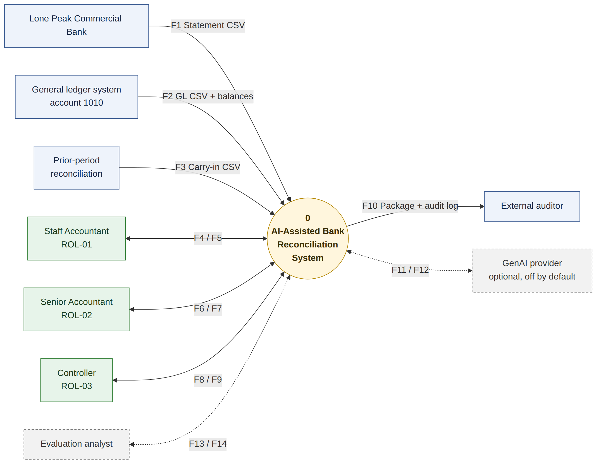
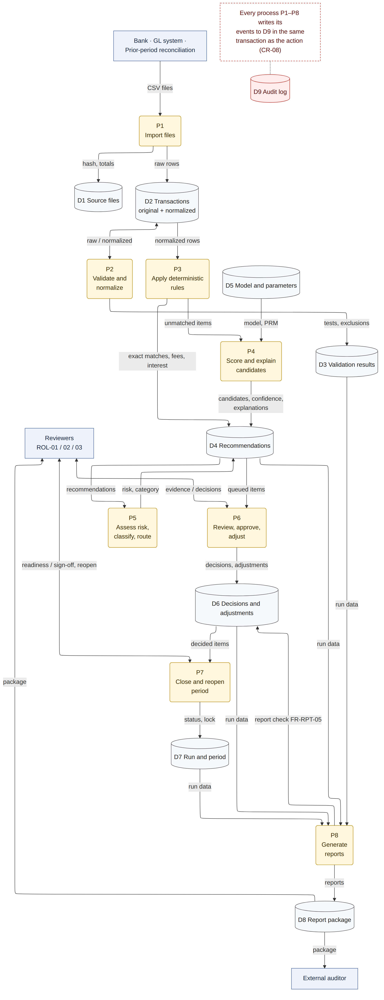
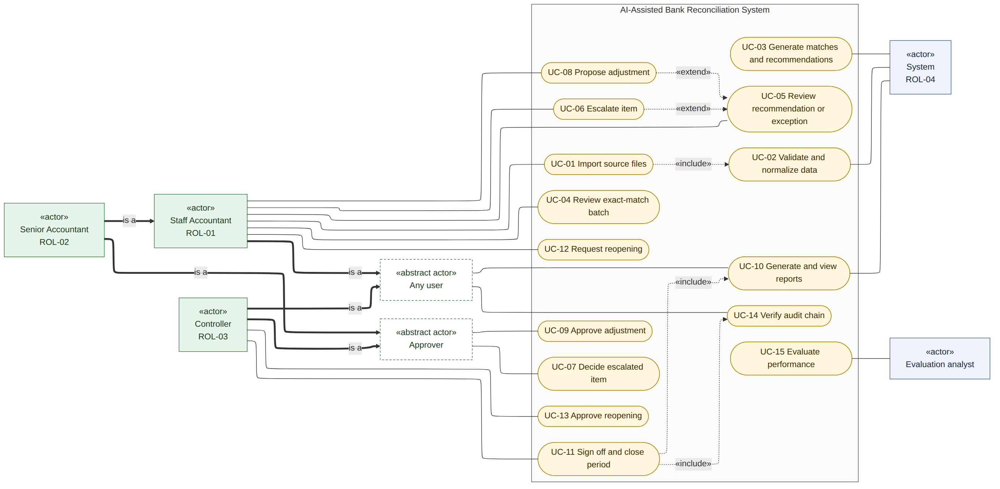
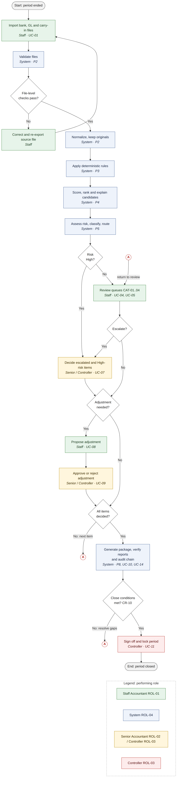
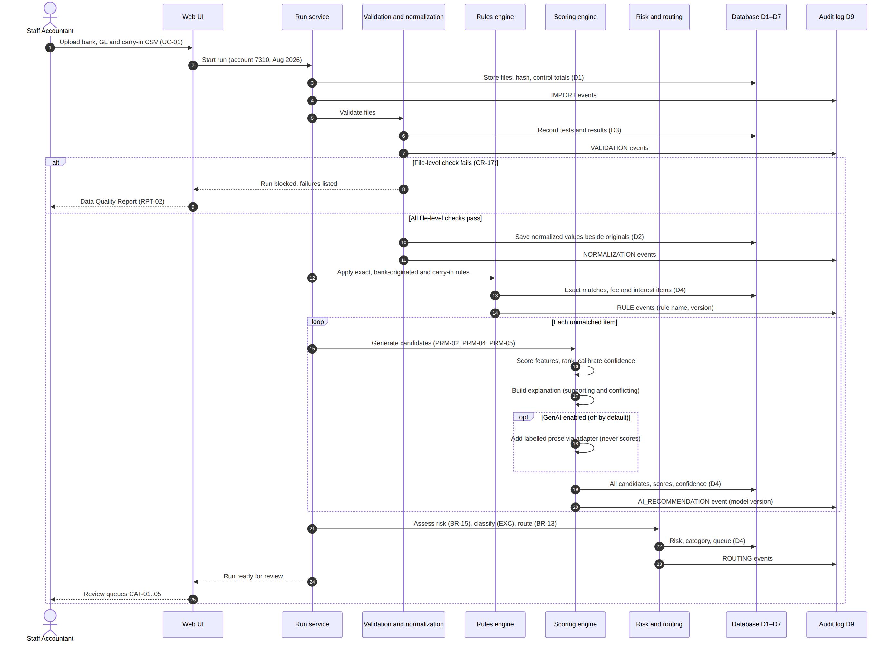
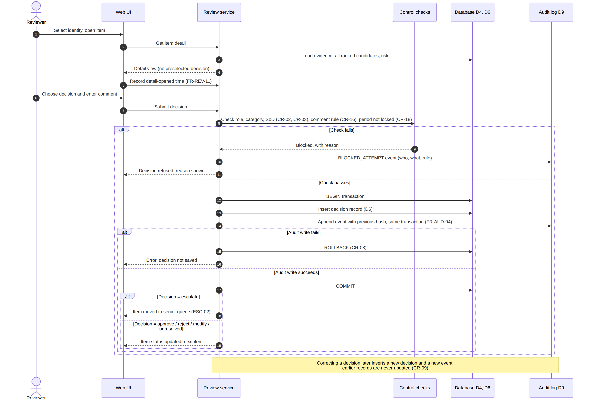
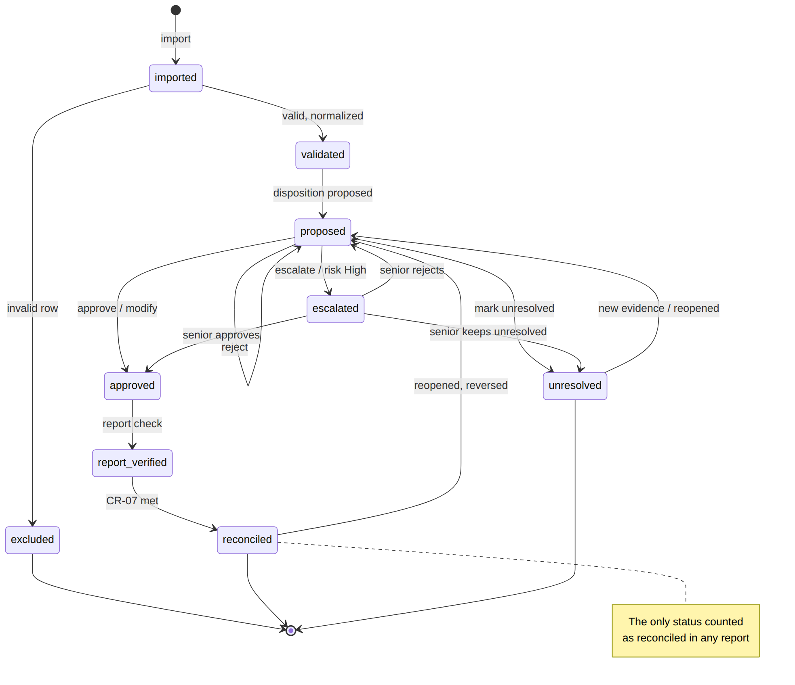
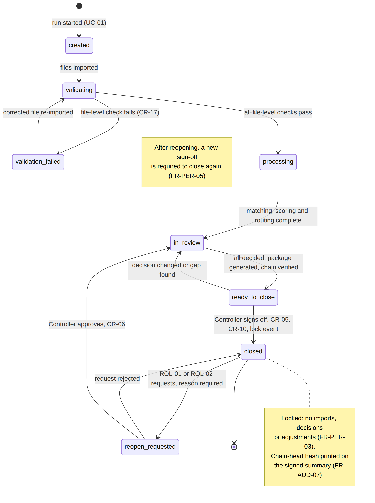
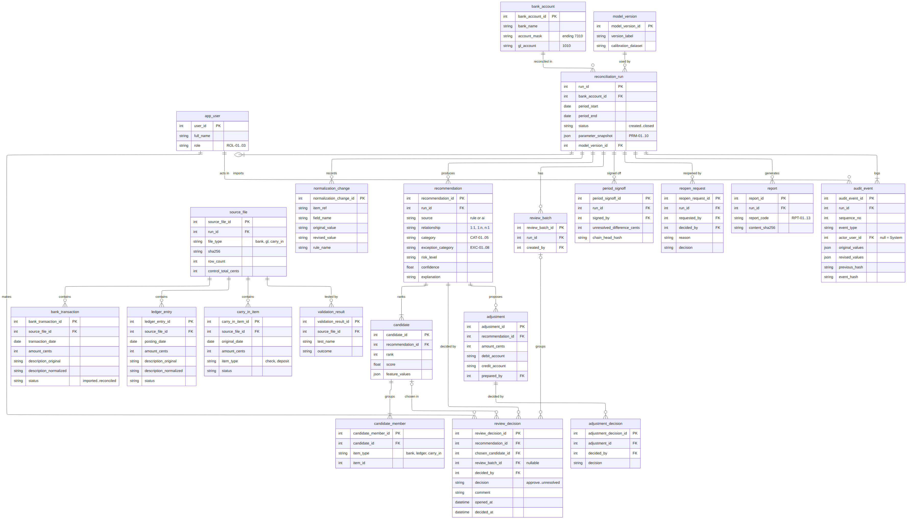

# Systems Analysis — AI-Assisted Bank Reconciliation

## 1. Purpose and Scope

This document turns the requirements in DOC-02 into a system view: who uses the system, what they do with it, how data moves through it, how an item and a period change state, and what data the system holds. It covers one bank account and one accounting period per run. Screen layouts and module structure belong to DOC-05 System Design.

Diagram sources are held as Mermaid files in `docs/diagrams/` beside the images used here.

## 2. Actors

| ID | Actor | Type | Description |
|---------|-----------------|------------|-------------------------------------------------------|
| ROL-01 | Staff Accountant | Human | Imports files, runs the reconciliation, performs first-level review, escalates, prepares adjustments, requests reopening |
| ROL-02 | Senior Accountant | Human | Everything ROL-01 does, plus decisions on escalated and high-risk items and approval of adjustments |
| ROL-03 | Controller | Human | Decides escalated and high-risk items, approves adjustments, signs off and closes the period, approves reopening |
| ROL-04 | System | System | Validates, normalizes, matches, scores, classifies, routes, verifies reports, writes system audit events |
| ACT-05 | Bank | External | Supplies the bank statement extract |
| ACT-06 | General ledger system | External | Supplies cash detail for account 1010 and the period balances |
| ACT-07 | Prior-period reconciliation | External | Supplies the carry-in list of outstanding items |
| ACT-08 | External auditor | External | Receives the reconciliation package and audit log |
| ACT-09 | GenAI provider | External, optional | Returns explanation prose only; off by default (DD-10) |
| ACT-10 | Evaluation analyst | External | Supplies ground-truth labels and receives evaluation metrics; no operational access |

Human actors select an identity from a list (DD-05). Separation of duties is enforced on the selected identity (CR-03..06).

## 3. Context and Data Flows

### 3.1 Context diagram

{height=4.3in}

| Flow | From → To | Content |
|-------|----------------------|----------------------------------------------------|
| F1 | Bank → System | Bank statement CSV |
| F2 | GL system → System | GL cash detail CSV with period opening and closing balances |
| F3 | Prior-period reconciliation → System | Carry-in outstanding items CSV |
| F4 | Staff Accountant → System | Files, review decisions, comments, escalations, proposed adjustments, reopen requests |
| F5 | System → Staff Accountant | Review queues, recommendations, evidence, explanations, reports |
| F6 | Senior Accountant → System | Senior decisions, adjustment approvals, reopen requests |
| F7 | System → Senior Accountant | Escalated and high-risk items, adjustments awaiting approval, reports |
| F8 | Controller → System | Adjustment approvals, sign-off, reopen approvals |
| F9 | System → Controller | Close readiness, reconciliation summary, reopen requests |
| F10 | System → External auditor | Reconciliation package and complete audit log |
| F11 | System → GenAI provider | Synthetic evidence summary for prose generation (optional) |
| F12 | GenAI provider → System | Explanation prose, labelled as AI-generated (optional) |
| F13 | Evaluation analyst → System | Ground-truth labels for the evaluation dataset |
| F14 | System → Evaluation analyst | Evaluation metrics and error analysis |

### 3.2 Data flow diagram, level 1

{height=7.2in}

| Process | Name | Requirements |
|------------|----------------------------------|----------------------------------|
| P1 | Import files | FR-IMP-01..06 |
| P2 | Validate and normalize | FR-VAL-01..07, FR-NRM-01..05 |
| P3 | Apply deterministic rules | FR-MAT-01..04 |
| P4 | Score and explain candidates | FR-AI-01..08, FR-GAI-01..04 |
| P5 | Assess risk, classify, route | FR-RSK-01, FR-EXC-01..03, FR-REV-01..02 |
| P6 | Review, approve, adjust | FR-REV-03..11, FR-ADJ-01..04 |
| P7 | Close and reopen period | FR-PER-01..05 |
| P8 | Generate reports | FR-RPT-01..05 |

| Store | Name | Main entities |
|--------|---------------------|----------------------------------------------------|
| D1 | Source files | source_file |
| D2 | Transactions, original and normalized | bank_transaction, ledger_entry, carry_in_item, normalization_change |
| D3 | Validation results | validation_result |
| D4 | Recommendations | recommendation, candidate, candidate_member |
| D5 | Model and parameters | model_version, parameter snapshot on reconciliation_run |
| D6 | Decisions and adjustments | review_decision, review_batch, adjustment, adjustment_decision |
| D7 | Run and period | reconciliation_run, period_signoff, reopen_request |
| D8 | Report package | report |
| D9 | Audit log | audit_event |

Every process writes its audit events to D9 inside the same transaction as the action it records (CR-08).

## 4. Use Case Model

{height=4.3in}

Senior Accountant inherits every Staff Accountant use case. Senior Accountant and Controller are both Approvers. All three human roles can view reports and verify the audit chain.

| ID | Use case | Primary actor | Trigger | Governing rules |
|--------|----------------------|------------|---------------------------|----------------|
| UC-01 | Import source files | ROL-01 | Period closed in the ledger and statement available | CR-17 |
| UC-02 | Validate and normalize data | ROL-04 | Files imported | FR-VAL, FR-NRM, CR-17 |
| UC-03 | Generate matches and recommendations | ROL-04 | Validation passed | BR-01..15 |
| UC-04 | Review exact-match batch | ROL-01 | CAT-01 queue not empty | CR-01, CR-11 |
| UC-05 | Review recommendation or exception | ROL-01 | CAT-02..04 queue not empty | CR-01, CR-15, CR-16 |
| UC-06 | Escalate item | ROL-01 | Reviewer judgment, or risk High | ESC-01, ESC-02 |
| UC-07 | Decide escalated item | ROL-02 / ROL-03 | Senior queue not empty | CR-02, CR-03 |
| UC-08 | Propose adjustment | ROL-01 | Bank-originated item or missing entry | FR-ADJ-01 |
| UC-09 | Approve adjustment | ROL-02 / ROL-03 | Adjustment awaiting approval | CR-04 |
| UC-10 | Generate and view reports | ROL-04 | Run reaches review, or on request | FR-RPT-01..04 |
| UC-11 | Sign off and close period | ROL-03 | Run is ready to close | CR-05, CR-10 |
| UC-12 | Request reopening | ROL-01 / ROL-02 | Error found after close | FR-PER-04 |
| UC-13 | Approve reopening | ROL-03 | Reopen request raised | CR-06 |
| UC-14 | Verify audit chain | Any user | On request, and before close | FR-AUD-05 |
| UC-15 | Evaluate performance | ACT-10 | Evaluation run | FR-EVL-01..11 |
## 5. Use Case Documents

Each use case follows the same structure. Rule IDs refer to DOC-02.

### UC-01 Import source files

| Field | Content |
|-----------------|-------------------------------------------------------------------|
| Use case | UC-01 Import source files |
| Objective | Load the bank statement, ledger cash detail and carry-in items for one account and period, and open a reconciliation run. |
| Business event | Accounting period closed in the ledger and the bank statement is available. |
| Primary actors | Staff Accountant (ROL-01), Senior Accountant (ROL-02) |
| Secondary actors | System (ROL-04), Bank (ACT-05), General ledger system (ACT-06), Prior-period reconciliation (ACT-07) |
| Pre-condition | Identity selected with role ROL-01 or ROL-02. No closed run exists for the same account and period. |
| Post-condition | Run exists with status validating. Each file is stored with its hash, row count and control totals. Import events are written. |
| Failure outcomes | A file is unreadable, has the wrong structure, or repeats a hash already imported. The file is rejected, the run stays in validating and the failure is listed in the Data Quality Report (RPT-02). |

| # | Actor | System |
|----|--------------------|---------------------------------------------------------|
| 1 | Selects bank account and period, uploads the bank, ledger and carry-in CSV files. | Creates the run, stores each file with SHA-256 hash, row count and control totals, and writes IMPORT audit events. |
| 2 | — | Runs validation and normalization (UC-02). |
| 3 | Reviews the import summary. | Shows the Data Import Report (RPT-01) and the Data Quality Report (RPT-02). |
| 4 | Confirms the import. | Moves the run to processing when all file-level checks pass. |

### UC-02 Validate and normalize data

| Field | Content |
|-----------------|-------------------------------------------------------------------|
| Use case | UC-02 Validate and normalize data |
| Objective | Confirm that imported data is complete and consistent, and produce normalized values while keeping every original value. |
| Business event | Files imported for a run. |
| Primary actors | System (ROL-04) |
| Secondary actors | Staff Accountant (ROL-01) |
| Pre-condition | Run status is validating and at least one file is stored. |
| Post-condition | Passed rows carry normalized values beside their originals. Validation results and transformation records are stored. Failing rows are excluded and reported. |
| Failure outcomes | A file-level check fails. Matching is blocked (CR-17), the run moves to validation_failed and the reviewer is asked for a corrected file. |

| # | Actor | System |
|----|--------|-----------------------------------------------------------------------|
| 1 | — | Checks file structure, required fields and data types (FR-VAL-01, FR-VAL-02). |
| 2 | — | Compares record counts and control totals: opening balance plus credits minus debits equals closing balance (FR-VAL-03). |
| 3 | — | Rejects duplicate transaction IDs, flags possible duplicate transactions, and flags rows dated outside the period (FR-VAL-04, FR-VAL-05). |
| 4 | — | Normalizes dates, amounts, descriptions, payee names and references, keeping each original value and the rule applied (FR-NRM-01..05). |
| 5 | — | Writes VALIDATION and NORMALIZATION audit events and produces the Transformation Report (RPT-03). |

### UC-03 Generate matches and recommendations

| Field | Content |
|-----------------|-------------------------------------------------------------------|
| Use case | UC-03 Generate matches and recommendations |
| Objective | Propose a match or an exception disposition for every item, with a confidence score, risk level and explanation. |
| Business event | Validation passed for a run. |
| Primary actors | System (ROL-04) |
| Secondary actors | GenAI provider (ACT-09), optional |
| Pre-condition | Run status is processing and all file-level checks passed. |
| Post-condition | Every item has a recommendation with category, confidence, risk level and explanation. Review queues are populated and the run moves to in_review. |
| Failure outcomes | Scoring fails for an item. The item is classified as an exception for manual investigation, the error is logged, and no partial queue is published. |

| # | Actor | System |
|----|--------|-----------------------------------------------------------------------|
| 1 | — | Applies exact match rules (BR-01, BR-02), bank-originated rules (BR-06) and carry-in clearing (BR-11). |
| 2 | — | Generates one-to-one and group candidates within the date window and caps (BR-03..05); items beyond the caps become EXC-08. |
| 3 | — | Scores candidates on date distance, amount, text, reference and relationship type, ranks them and calibrates confidence (FR-AI-04, FR-AI-05). |
| 4 | — | Builds a plain-language explanation listing supporting and conflicting evidence; optional labelled prose may be added (FR-AI-06, FR-GAI-02). |
| 5 | — | Assigns risk level (BR-15), classifies exceptions (EXC-01..08) and routes each item to a category (BR-13). |
| 6 | — | Writes RULE, AI_RECOMMENDATION and ROUTING audit events with model version and all candidate scores. |

### UC-04 Review exact-match batch

| Field | Content |
|-----------------|-------------------------------------------------------------------|
| Use case | UC-04 Review exact-match batch |
| Objective | Approve or reject a batch of exact matches with one action while keeping a decision record for each item. |
| Business event | CAT-01 queue contains items. |
| Primary actors | Staff Accountant (ROL-01), Senior Accountant (ROL-02) |
| Secondary actors | System (ROL-04) |
| Pre-condition | Identity selected with role ROL-01 or ROL-02. Period is not locked. Batch contains only CAT-01 items with Low risk. |
| Post-condition | One decision record and one audit event exist for each item in the batch. Approved items move to approved. |
| Failure outcomes | A separation-of-duties or period-lock check fails. Nothing is written, the reason is shown and a BLOCKED_ATTEMPT event is recorded. |

| # | Actor | System |
|----|-----------------------------|------------------------------------------------|
| 1 | Opens the CAT-01 queue. | Lists the batch with item count, total amount and the rule that matched each item. |
| 2 | Opens any item to inspect it, and removes items that need individual review. | Returns removed items to the CAT-02 or CAT-03 queue. |
| 3 | Approves the batch and enters an optional comment. | Writes one decision record and one audit event per item, then updates each item to approved (CR-11). |
| 4 | Rejects the batch instead. | Writes one rejection per item and returns each item for re-proposal. |

### UC-05 Review recommendation or exception

| Field | Content |
|-----------------|-------------------------------------------------------------------|
| Use case | UC-05 Review recommendation or exception |
| Objective | Decide a single recommended match or exception disposition on the evidence shown. |
| Business event | An item is waiting in the CAT-02, CAT-03 or CAT-04 queue. |
| Primary actors | Staff Accountant (ROL-01), Senior Accountant (ROL-02) |
| Secondary actors | System (ROL-04) |
| Pre-condition | Identity selected with role ROL-01 or ROL-02. Period is not locked. Item status is proposed. |
| Post-condition | A decision record with reviewer identity, comment and timestamps is stored, the audit event is written, and the item status is updated. |
| Failure outcomes | The comment rule (CR-16) or the period lock (CR-18) blocks the decision. Nothing is written and the reason is shown. |

| # | Actor | System |
|----|-------------------|----------------------------------------------------------|
| 1 | Opens the item from the queue. | Shows source evidence, every ranked candidate, confidence band and value, risk level with the rules that triggered, supporting and conflicting evidence, suggested exception category and next action, and the item history. No decision is preselected. |
| 2 | — | Records the time the detail view was opened (FR-REV-11). |
| 3 | Chooses approve, modify by selecting a different candidate, reject, or mark unresolved, and enters a comment where required. | Checks role, category, separation of duties, comment rule and period lock. |
| 4 | — | Writes the decision and its audit event in one transaction, then updates the item status (CR-08). |
| 5 | Moves to the next item. | Presents the next item in queue order: risk first, then lowest confidence. |

### UC-06 Escalate item

| Field | Content |
|-----------------|-------------------------------------------------------------------|
| Use case | UC-06 Escalate item |
| Objective | Move an item that needs senior judgment into the senior queue. Extends UC-05. |
| Business event | Reviewer judgment during review, or a High risk level assigned by the system. |
| Primary actors | Staff Accountant (ROL-01), Senior Accountant (ROL-02), System (ROL-04) |
| Secondary actors | None |
| Pre-condition | Item status is proposed and the period is not locked. |
| Post-condition | Item status is escalated, the item appears in the CAT-05 queue, and the escalating identity is recorded for the CR-03 check. |
| Failure outcomes | No senior approver is available who did not escalate the item. The item stays escalated and is reported as awaiting senior review. |

| # | Actor | System |
|----|-----------|--------------------------------------------------------------------|
| 1 | Chooses escalate and enters a reason. | Validates that a comment is present (CR-16). |
| 2 | — | Sets status to escalated, records the escalating user and writes the audit event. |
| 3 | — | Adds the item to the senior queue (ESC-02). Items with risk High are routed there by the system without a reviewer action (ESC-01). |

### UC-07 Decide escalated item

| Field | Content |
|-----------------|-------------------------------------------------------------------|
| Use case | UC-07 Decide escalated item |
| Objective | Record a senior decision on an escalated or high-risk item. |
| Business event | Senior queue contains items. |
| Primary actors | Senior Accountant (ROL-02), Controller (ROL-03) |
| Secondary actors | System (ROL-04) |
| Pre-condition | Identity selected with role ROL-02 or ROL-03, and that identity did not review or escalate the item (CR-03). Period is not locked. |
| Post-condition | A senior decision record and audit event exist. The item moves to approved, unresolved, or back to proposed. |
| Failure outcomes | The separation-of-duties check fails. The decision is refused, a BLOCKED_ATTEMPT event is written and the item stays escalated. |

| # | Actor | System |
|----|-----------------------|------------------------------------------------------|
| 1 | Opens an item from the senior queue. | Shows the same evidence as UC-05 plus the escalation reason, the escalating user and the risk rules that triggered. |
| 2 | Approves, rejects, or keeps the item unresolved, with a comment. | Checks role and separation of duties (CR-02, CR-03). |
| 3 | — | Writes the decision and audit event in one transaction and updates the item status. |

### UC-08 Propose adjustment

| Field | Content |
|-----------------|-------------------------------------------------------------------|
| Use case | UC-08 Propose adjustment |
| Objective | Record a proposed correcting entry for a bank-originated item or a missing ledger entry. Extends UC-05. |
| Business event | An exception in category EXC-03, EXC-04 or EXC-06 is being reviewed. |
| Primary actors | Staff Accountant (ROL-01), Senior Accountant (ROL-02) |
| Secondary actors | System (ROL-04) |
| Pre-condition | Item is an exception awaiting disposition and the period is not locked. |
| Post-condition | An adjustment record exists with amount, debit and credit accounts, rationale, linked items and preparer, awaiting approval. |
| Failure outcomes | Required accounts or rationale are missing. The adjustment is not created and the reviewer is shown what is missing. |

| # | Actor | System |
|----|---------------------|--------------------------------------------------------|
| 1 | Chooses to propose an adjustment. | Pre-fills amount, suggested accounts and rationale from the exception category (BR-16). |
| 2 | Confirms or changes the accounts and rationale, and links supporting evidence. | Validates that amount, both accounts and a rationale are present. |
| 3 | Submits the proposal. | Stores the adjustment as awaiting approval, records the preparer and writes the audit event. The entry is never posted (CR-12). |

### UC-09 Approve adjustment

| Field | Content |
|-----------------|-------------------------------------------------------------------|
| Use case | UC-09 Approve adjustment |
| Objective | Approve or reject a proposed adjustment. |
| Business event | An adjustment is awaiting approval. |
| Primary actors | Senior Accountant (ROL-02), Controller (ROL-03) |
| Secondary actors | System (ROL-04) |
| Pre-condition | Identity selected with role ROL-02 or ROL-03 and is not the preparer (CR-04). Period is not locked. |
| Post-condition | An approval or rejection record and audit event exist. Approved adjustments appear in the Adjustment Report (RPT-07). |
| Failure outcomes | The approver is the preparer. The action is refused, a BLOCKED_ATTEMPT event is written and the adjustment stays awaiting approval. |

| # | Actor | System |
|----|--------------------------|---------------------------------------------------|
| 1 | Opens the adjustment awaiting approval. | Shows amount, accounts, rationale, linked items, evidence and preparer. |
| 2 | Approves or rejects, with a comment. | Checks role and that the approver is not the preparer (CR-04). |
| 3 | — | Writes the decision and audit event in one transaction and updates the adjustment status. |

### UC-10 Generate and view reports

| Field | Content |
|-----------------|-------------------------------------------------------------------|
| Use case | UC-10 Generate and view reports |
| Objective | Produce the process reports and the reconciliation package for a run, and make them available to reviewers and the auditor. |
| Business event | A run reaches review, or a user requests the package. |
| Primary actors | System (ROL-04) |
| Secondary actors | Staff Accountant (ROL-01), Senior Accountant (ROL-02), Controller (ROL-03), External auditor (ACT-08) |
| Pre-condition | A run exists with imported and validated data. |
| Post-condition | Reports RPT-01..13 exist as HTML and CSV with a content hash. Approved items that appear correctly move to report_verified. |
| Failure outcomes | A report cannot be generated. The package is not marked complete, the run cannot reach ready_to_close, and the failure is logged. |

| # | Actor | System |
|----|---------------------|--------------------------------------------------------|
| 1 | Requests the report package. | Generates RPT-01..13 from run data (FR-RPT-01). |
| 2 | — | Verifies that every approved item appears correctly, then sets those items to report_verified and on to reconciled when all six conditions hold (FR-RPT-05, CR-07). |
| 3 | Opens or exports a report. | Shows the report as HTML and offers CSV; the content hash is recorded. |

### UC-11 Sign off and close period

| Field | Content |
|-----------------|-------------------------------------------------------------------|
| Use case | UC-11 Sign off and close period |
| Objective | Confirm that the reconciliation is complete and lock the period. |
| Business event | Run status is ready_to_close. |
| Primary actors | Controller (ROL-03) |
| Secondary actors | System (ROL-04) |
| Pre-condition | Every item is decided, escalations and adjustments are decided, the package is generated and the audit chain verifies. The signer is not the only first-level reviewer (CR-05). |
| Post-condition | Run status is closed, a sign-off record with final totals, unresolved items and the chain-head hash exists, and a lock event is written. |
| Failure outcomes | A close condition fails. Close is refused with the unmet condition listed and the run returns to in_review. |

| # | Actor | System |
|----|----------------|--------------------------------------------------------------|
| 1 | Opens the close screen. | Shows the bank-to-book statement (BR-17), unresolved items, the unresolved difference and the chain verification result. |
| 2 | Reviews unresolved items and any remaining difference, and enters a comment where a difference remains. | Checks the close conditions (CR-10) and separation of duties (CR-05). |
| 3 | Signs off. | Records the sign-off with the chain-head hash, sets the run to closed, writes the lock event and blocks further changes (FR-PER-03). |

### UC-12 Request reopening

| Field | Content |
|-----------------|-----------------------------------------------------------------|
| Use case | UC-12 Request reopening |
| Objective | Ask for a closed period to be reopened so a decision can be corrected. |
| Business event | An error or new evidence is found after close. |
| Primary actors | Staff Accountant (ROL-01), Senior Accountant (ROL-02) |
| Secondary actors | System (ROL-04) |
| Pre-condition | Run status is closed. Identity selected with role ROL-01 or ROL-02. |
| Post-condition | A reopen request with reason and requester exists and the run moves to reopen_requested. |
| Failure outcomes | The reason is missing or the run is not closed. The request is not created. |

| # | Actor | System |
|----|-------------|--------------------------------------------------------------|
| 1 | Opens the closed run and requests reopening with a reason and the items affected. | Validates that a reason is present and the run is closed. |
| 2 | — | Stores the request, sets the run to reopen_requested and writes the audit event. |
| 3 | — | Notifies the Controller queue (ESC-05). |

### UC-13 Approve reopening

| Field | Content |
|-----------------|-------------------------------------------------------------------|
| Use case | UC-13 Approve reopening |
| Objective | Decide a reopen request and, if approved, return the period to review. |
| Business event | A reopen request is waiting. |
| Primary actors | Controller (ROL-03) |
| Secondary actors | System (ROL-04) |
| Pre-condition | Run status is reopen_requested and the approver is not the requester (CR-06). |
| Post-condition | The decision is recorded. On approval the run returns to in_review with original and revised state captured; on rejection it returns to closed. |
| Failure outcomes | The approver is the requester. The action is refused and a BLOCKED_ATTEMPT event is written. |

| # | Actor | System |
|----|---------------------|--------------------------------------------------------|
| 1 | Opens the reopen request. | Shows the reason, requester, affected items and the original state. |
| 2 | Approves or rejects, with a comment. | Checks that the approver is not the requester (CR-06). |
| 3 | — | Records original state, revised state, reason, requester and approver, updates the run status and writes the Change and Override Report entry (RPT-10). A new sign-off is required to close again (FR-PER-05). |

### UC-14 Verify audit chain

| Field | Content |
|-----------------|-------------------------------------------------------------------|
| Use case | UC-14 Verify audit chain |
| Objective | Confirm that no audit event has been altered since it was written. |
| Business event | A user requests verification, or the system checks before close. |
| Primary actors | Staff Accountant (ROL-01), Senior Accountant (ROL-02), Controller (ROL-03), System (ROL-04) |
| Secondary actors | None |
| Pre-condition | A run exists with at least one audit event. |
| Post-condition | A verification result is shown: chain intact, or the first event where the chain breaks. |
| Failure outcomes | The chain does not verify. Close is blocked (CR-10) and the broken event is reported for investigation. |

| # | Actor | System |
|----|----------------|-------------------------------------------------------------|
| 1 | Requests chain verification for the run. | Recomputes each event hash from the event content and the previous hash (FR-AUD-05). |
| 2 | — | Reports the result, the number of events checked and the chain-head hash. |
| 3 | Reviews the result. | Includes the same result in the Reconciliation Summary (RPT-09) at close. |

### UC-15 Evaluate performance

| Field | Content |
|-----------------|-------------------------------------------------------------------|
| Use case | UC-15 Evaluate performance |
| Objective | Measure recommendation quality and control effectiveness against labelled data, and compare the hybrid system with the rules-only baseline. |
| Business event | An evaluation run is requested. |
| Primary actors | Evaluation analyst (ACT-10) |
| Secondary actors | System (ROL-04) |
| Pre-condition | A seeded evaluation dataset with ground-truth labels exists, separate from the calibration dataset (FR-EVL-11). |
| Post-condition | Metrics are produced with the sample size beside every rate, by confidence band, and for both rules-only and hybrid. |
| Failure outcomes | Ground truth is missing or incomplete for a scenario. The affected metric is reported as not measured rather than estimated. |

| # | Actor | System |
|----|------------------------|------------------------------------------------------|
| 1 | Runs the evaluation on the labelled dataset. | Runs rules-only and hybrid over the same data and compares results (FR-EVL-09). |
| 2 | — | Computes precision, recall, approval and rejection rates, exception accuracy, audit completeness and the hypothetical false automatic match rate (BR-19). |
| 3 | Reviews metrics and error analysis. | Produces the AI Performance Report (RPT-12) with n beside every rate. |
## 6. Activity View: One Reconciliation Run

{height=7.4in}

The flow has two gates. Matching cannot start until every file-level validation check passes (CR-17), and sign-off cannot happen until the close conditions are met (CR-10). Circles marked A are connectors: the flow continues at the matching A. Colour shows the performing role.

## 7. Sequence Views

### 7.1 Import to review queues

{height=6.2in}

Deterministic rules run before scoring, so only unmatched items enter the candidate loop. Generative AI, when enabled, adds prose after scoring is complete and never affects a score (CR-13).

### 7.2 Review decision with atomic audit write

{height=5.6in}

The decision record and its audit event commit together. If the audit write fails the decision is rolled back (CR-08), which is what makes condition 5 of CR-07 enforceable. A failed permission or separation-of-duties check writes a BLOCKED_ATTEMPT event, so refused actions leave evidence too.

## 8. State Models

### 8.1 Reconciliation item lifecycle

{height=5.4in}

| From | To | Trigger and guard |
|------------------|------------------|---------------------------------------------------|
| — | imported | Row loaded from a source file (P1) |
| imported | excluded | Row fails validation; listed in RPT-02 |
| imported | validated | Row passes validation and is normalized |
| validated | proposed | Match or exception disposition proposed and a category assigned (BR-13) |
| proposed | approved | Reviewer approves, modifies or selects a candidate (CR-01, CR-16) |
| proposed | escalated | Reviewer escalates, or risk level is High (ESC-01, ESC-02) |
| proposed | proposed | Reviewer rejects; the item is re-proposed with the next candidate or as an exception |
| proposed | unresolved | Reviewer marks unresolved with a comment |
| escalated | approved | Senior approves (CR-02, CR-03) |
| escalated | proposed | Senior rejects the recommendation |
| escalated | unresolved | Senior keeps the item unresolved |
| approved | report_verified | Item appears correctly in the reconciliation report (FR-RPT-05) |
| report_verified | reconciled | All six conditions hold (CR-07) |
| reconciled | proposed | Period reopened and the decision reversed (CR-18) |
| unresolved | proposed | New evidence before close, or period reopened |

An approved exception disposition, such as an outstanding check carried forward, reaches reconciled in the same way as a match. Only unresolved items remain open at close, and they are carried forward.

### 8.2 Run and period lifecycle

{height=6.0in}

| From | To | Trigger and guard |
|--------------------|--------------------|--------------------------------------------|
| — | created | Run started for one account and period (UC-01) |
| created | validating | Files imported |
| validating | validation_failed | A file-level check fails (CR-17) |
| validation_failed | validating | Corrected file re-imported |
| validating | processing | All file-level checks pass |
| processing | in_review | Matching, scoring, risk and routing complete |
| in_review | ready_to_close | No item pending, escalations and adjustments decided, package generated, audit chain verified (CR-10) |
| ready_to_close | in_review | A decision is changed or a gap is found |
| ready_to_close | closed | Controller signs off; lock event written (CR-05) |
| closed | reopen_requested | ROL-01 or ROL-02 requests reopening with a reason |
| reopen_requested | closed | Request rejected |
| reopen_requested | in_review | Controller approves (CR-06); a new sign-off is required to close again |

## 9. Logical Data Model

{height=6.4in}

Key attributes only. DOC-04 defines every column, type, constraint and default.

| Entity | Holds | Notes |
|-----------------------|------------------------|--------------------------------------|
| app_user | Reviewer identities and roles | Selected from a list; no authentication (DD-05) |
| bank_account | Account in scope and its ledger account | One account per run |
| reconciliation_run | One account and one period | Holds status and a snapshot of PRM-01..10 for reproducibility |
| source_file | Imported file metadata | Hash, row count and control totals (FR-IMP-04) |
| bank_transaction, ledger_entry, carry_in_item | Items from each source | Each holds original and normalized values and its own status |
| validation_result | Test outcomes per file and row | Feeds RPT-02 |
| normalization_change | Original value, revised value, rule | Feeds RPT-03 |
| model_version | Scoring and calibration model in use | Recorded on every recommendation (FR-AI-07) |
| recommendation | Proposed match or exception | Category, exception category, risk, confidence, explanation |
| candidate, candidate_member | Every ranked candidate and its members | Supports one-to-many and many-to-one groups; nothing is discarded (FR-REV-09) |
| review_batch, review_decision | Batches and individual decisions | One decision record per item even inside a batch (CR-11) |
| adjustment, adjustment_decision | Proposed entries and their approvals | Never posted (CR-12); preparer and approver compared for CR-04 |
| period_signoff | Sign-off, final totals, chain-head hash | Produced at close (FR-AUD-07) |
| reopen_request | Reason, requester, approver, decision | Feeds RPT-10 |
| report | Generated reports and content hashes | RPT-01..13 |
| audit_event | Every system and human action | Append-only, hash-chained (FR-AUD-01..07) |

Statuses on item and run records are current-state fields. Their history is reconstructed from audit events, and no audit event is ever updated (CR-09).

## 10. Traceability

| Use case | Requirements | Controls |
|------------|-----------------------------------------|----------------------------|
| UC-01 | FR-IMP-01..06 | CR-17 |
| UC-02 | FR-VAL-01..07, FR-NRM-01..05 | CR-17 |
| UC-03 | FR-MAT-01..04, FR-AI-01..08, FR-RSK-01, FR-EXC-01..03, FR-GAI-01..04 | CR-13, CR-15 |
| UC-04 | FR-REV-01, FR-REV-06 | CR-01, CR-11, CR-18 |
| UC-05 | FR-REV-02..05, FR-REV-07, FR-REV-09..11 | CR-01, CR-15, CR-16, CR-18 |
| UC-06 | FR-REV-08 | CR-16, ESC-01, ESC-02 |
| UC-07 | FR-REV-04, FR-REV-05 | CR-02, CR-03 |
| UC-08 | FR-ADJ-01 | CR-12, CR-16 |
| UC-09 | FR-ADJ-02..04 | CR-04 |
| UC-10 | FR-RPT-01..05 | CR-07 |
| UC-11 | FR-PER-01..03, FR-AUD-07 | CR-05, CR-10 |
| UC-12 | FR-PER-04 | CR-18 |
| UC-13 | FR-PER-04, FR-PER-05 | CR-06, CR-09 |
| UC-14 | FR-AUD-05 | CR-10 |
| UC-15 | FR-EVL-01..11 | CR-14 |

| Diagram | Covers |
|--------------------------------|------------------------------------------------|
| Context diagram, DFD level 1 | Brief §4 workflow, §7 audit processes |
| Use case diagram and documents | Brief §6 approval design, §12 deliverables |
| Activity diagram | Brief §4 end-to-end workflow, §14 completion criteria |
| Sequence: import to queues | Brief §4, §5, §10 technical approach |
| Sequence: review decision | Brief §6, §7, §14 |
| Item and period state diagrams | Brief §6, §7 reopening, §14 |
| Logical ERD | Brief §7 minimum audit fields, §9 data scope |
