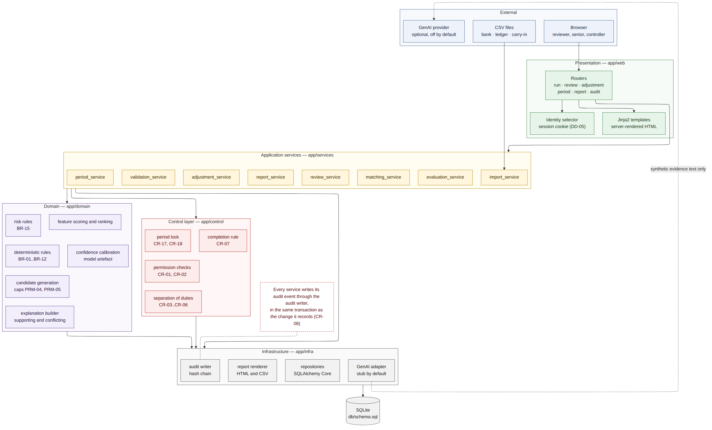

# System Design — AI-Assisted Bank Reconciliation

## 1. Purpose and Scope

This document defines how the system is built: its layers and modules, the technology used and why, how data is accessed, how the audit chain is produced and verified, how matching and review work internally, the API surface, error handling, security, permissions, configuration, report generation, performance targets, the testing approach, and the decisions taken along the way.

It covers design only. Implementation begins in Stage 6 with the deterministic baseline.

## 2. Architecture

{height=5.6in}

| Layer | Package | Responsibility | May call |
|-----------------|-----------------|--------------------------------------------|-----------------|
| Presentation | `app/web` | Routers, templates, identity selection | Services |
| Application services | `app/services` | One service per workflow step; owns transactions | Control, domain, infrastructure |
| Control | `app/control` | Permission, separation of duties, period lock, completion rule | Infrastructure |
| Domain | `app/domain` | Rules, candidate generation, scoring, calibration, risk, explanations | Nothing |
| Infrastructure | `app/infra` | Repositories, audit writer, report renderer, GenAI adapter | Database |

Dependencies point downward only. The domain layer performs no input or output at all: it receives plain data structures and returns results, which is what makes rules and scoring reproducible and testable without a database.

### 2.1 Module structure

```
app/
├── main.py                 FastAPI application, router registration
├── config.py               Configuration load and parameter snapshot
├── web/
│   ├── routes_run.py       Import, run status, dashboard
│   ├── routes_review.py    Queues, item detail, decisions, batches
│   ├── routes_adjust.py    Adjustment proposal and approval
│   ├── routes_period.py    Close readiness, sign-off, reopen
│   ├── routes_report.py    Report package and exports
│   ├── routes_audit.py     Audit log and chain verification
│   ├── identity.py         Identity selector and session cookie
│   └── templates/          Jinja2 templates, one per wireframe screen
├── services/
│   ├── import_service.py       W2, UC-01
│   ├── validation_service.py   UC-02, includes normalization
│   ├── matching_service.py     UC-03, orchestrates domain layer
│   ├── review_service.py       UC-04..UC-07
│   ├── adjustment_service.py   UC-08, UC-09
│   ├── period_service.py       UC-11..UC-13
│   ├── report_service.py       UC-10, RPT-01..13
│   └── evaluation_service.py   UC-15, reads ground truth
├── control/
│   ├── permissions.py      Role and category checks (CR-01, CR-02)
│   ├── duties.py           Separation of duties (CR-03..CR-06)
│   ├── period_lock.py      Lock and validation gates (CR-17, CR-18)
│   └── completion.py       Six-condition rule (CR-07)
├── domain/
│   ├── rules.py            BR-01..BR-12 deterministic rules
│   ├── candidates.py       Candidate and group generation
│   ├── features.py         Five scoring features
│   ├── scoring.py          Weighted score and ranking
│   ├── calibration.py      Score to calibrated confidence
│   ├── risk.py             BR-15 risk rules
│   └── explanation.py      Supporting and conflicting evidence
├── infra/
│   ├── db.py               Engine, schema bootstrap, transactions
│   ├── repositories/       One module per aggregate
│   ├── audit.py            Event builder, hash chain, verification
│   ├── reports/            Renderers and templates for RPT-01..13
│   └── genai/              adapter.py, stub.py, gemini.py
└── cli.py                  Command line entry points
```

## 3. Technology

Every dependency is free, installs with pip, and earns its place.

| Choice | Used for | Why this, not the alternative |
|---------------|--------------|------------------------------------------------------------|
| Python 3.11+ | Whole system | Standard library covers CSV, hashing, JSON and SQLite; no compiled dependencies |
| FastAPI | HTTP routing | Typed request handling and automatic input validation; Flask would need the same checks written by hand |
| Uvicorn | Server | Single-process local server, no configuration |
| Jinja2 | HTML rendering | Server-rendered pages keep the whole request path inspectable; a front-end framework would add build tooling without changing what reviewers see |
| SQLAlchemy Core | Database access | Parameterized statements and table reflection from `schema.sql`. The ORM is not used: it would restate table definitions already held in the schema, and the schema is the source of truth |
| SQLite | Storage | Single file, zero setup, supports triggers and CHECK constraints, which is where the controls live |
| RapidFuzz | Text similarity | Fast, dependency-free token-set ratio. Python's `difflib` is slower and handles reordered words poorly, which matters for abbreviated payee names |
| scikit-learn | Confidence calibration | Isotonic regression is exactly the calibration tool needed. Used for nothing else, and never for matching decisions (DD-11) |
| pytest, httpx | Tests | Standard test runner plus an HTTP client for route tests |

Deliberately not used: an ORM, a task queue, Docker, a front-end framework, a cloud service, or any paid API.

## 4. Data Access

| Point | Design |
|---------------|---------------------------------------------------------------------|
| Source of truth | `db/schema.sql`. On startup the engine executes it if the database is empty, then reflects the tables |
| Statements | SQLAlchemy Core with bound parameters only; no string-built SQL anywhere |
| Repositories | One module per aggregate (run, transactions, recommendations, decisions, adjustments, period, audit, reports). Services never write SQL |
| Transactions | The service owns the boundary. Each request opens one transaction; the change and its audit event commit together, or neither does (CR-08) |
| Write mode | `BEGIN IMMEDIATE` for any write, so the audit sequence number cannot be allocated twice |
| Journal mode | WAL, so reading a report does not block a decision |
| Identifiers | Database-assigned integers. Display identifiers (BT-, GL-, CI-) come from the source files and are kept as given |

## 5. Audit and Hash Chain

### 5.1 Writing an event

1. The service calls `audit.write(event)` inside its open transaction.
2. The writer takes the next `sequence_no` for the run as `MAX(sequence_no) + 1`.
3. It serializes the event to canonical JSON: keys sorted, UTF-8, no insignificant whitespace, integers for money, ISO 8601 for dates.
4. It computes `event_hash = SHA-256(previous_hash + "|" + canonical_json)`, where `previous_hash` is the previous event's hash, or the literal `GENESIS` for the first event in a run.
5. It inserts the row. Triggers make the row immutable from that point (CR-09).

Because both the change and the event are inside one transaction, a failed audit write rolls back the action that caused it.

### 5.2 Verifying the chain

Verification reads events in sequence order, recomputes each hash from the stored content and the previous hash, and stops at the first mismatch. It reports events checked, the chain-head hash, and the first broken sequence number if any. The result appears on the audit screen, blocks close when broken (CR-10), and is printed on the signed Reconciliation Summary (FR-AUD-07).

### 5.3 Stated limits

Trigger-based protection applies to changes made through this application's connection. Anyone holding the database file can rebuild it, including the chain. What makes that detectable is the chain-head hash recorded in the signed summary and in the exported report package, which is kept outside the database. This is weaker than write-once storage and is described as such in every document and in the code comments (DD-06).

## 6. Matching Pipeline

Order matters: deterministic rules run first, so scoring never sees an item a rule already settled.

| Step | Module | Design |
|------------------|---------------------------------|--------------------------------------------------|
| 1. Exact rules | `domain/rules.py` | Equal amount in cents, same signed cash effect, equal non-empty normalized reference, same business date, and exactly one candidate on each side (BR-01, BR-02) |
| 2. Bank-originated | `domain/rules.py` | Bank type code in FEE, INT, RTN, or description keyword match, with no ledger counterpart (BR-06) |
| 3. Carry-in clearing | `domain/rules.py` | Current-period bank item matched to a carry-in item on amount, direction and reference (BR-11) |
| 4. Candidate generation | `domain/candidates.py` | Blocking on signed effect and date window (PRM-02), then amount: exact amount first, then within the near-miss tolerance. At most PRM-04 candidates per item |
| 5. Group search | `domain/candidates.py` | Depth-limited search up to PRM-05 members, pruned by remaining amount and date window, stopping at the first five solutions. If the search hits either cap, the item becomes EXC-08 rather than being dropped (DD-07) |
| 6. Scoring | `domain/features.py`, `scoring.py` | Five features, each normalized to 0..1, combined as a weighted sum |
| 7. Calibration | `domain/calibration.py` | Isotonic regression maps score to a calibrated probability, fitted on the July dataset only (DD-11) |
| 8. Risk | `domain/risk.py` | Rule-based, inspectable, never learned |
| 9. Explanation | `domain/explanation.py` | Sentence templates over feature values, plus conflict detectors |
| 10. Routing | `services/matching_service.py` | Category assigned by BR-13, first match wins, High risk checked first |

### 6.1 Features

| Feature | Definition | Weight (default) |
|---------------|-----------------------------------------------------------|------------|
| Date distance | `exp(-business_day_gap / PRM-02)`; 1.0 on the same day | 0.20 |
| Amount similarity | `1 - abs(a - b) / max(a, b)`; 1.0 when equal in cents | 0.30 |
| Text similarity | RapidFuzz token-set ratio over normalized description and payee, scaled to 0..1 | 0.25 |
| Reference similarity | 1.0 when normalized references are equal and non-empty, partial ratio otherwise, 0 when either is missing | 0.20 |
| Relationship type | 1.0 for one-to-one, 0.8 for a group | 0.05 |

Weights live in configuration and are tuned on the calibration dataset only. The evaluation dataset is never used to choose them (DD-11).

### 6.2 Risk rules

| ID | Condition | Level |
|-----------|--------------------------------------------------------|-------------|
| RR-01 | Amount at or above PRM-01 | High |
| RR-02 | Suspected duplicate (BR-07) | High |
| RR-03 | Unexplained item (EXC-07) | High |
| RR-04 | Counterparty not seen earlier in the period or in carry-in | Medium |
| RR-05 | Group match (one-to-many or many-to-one) | Medium |
| RR-06 | Stale item (BR-10) | Medium |
| RR-07 | None of the above | Low |

The highest triggered level applies, and every triggered rule is stored with the recommendation and shown to the reviewer.

### 6.3 Explanations and conflicting evidence

Supporting sentences are generated from the feature values that contributed most. Conflict detectors run separately and always report, whatever the score:

| Detector | Raises |
|-------------------|-------------------------------------------------------------|
| Close runner-up | Second candidate within PRM-08 of the first |
| Repeated amount | The same amount appears more than once on the other side within the window |
| Reference mismatch | Both references present and different |
| Date at the edge | Gap equals the PRM-02 limit |
| Group tolerance | Group sums exactly but spans more than two business days |
| Novel counterparty | Counterparty not seen before in this period |

If the optional GenAI adapter is enabled, its prose is stored in a separate field, labelled in the interface, and shown beside the deterministic explanation, never in place of it (CR-13).
## 7. Review and Approval

| Point | Design |
|------------|-----------------------------------------------------------------------|
| Queue order | Risk descending, then confidence ascending, then amount descending. The least certain work surfaces first |
| No filtering | Low-confidence items cannot be hidden. The interface offers sorting, never a confidence filter (CR-15) |
| Detail required | Approving a non-exact item requires the detail view to have been opened; the route rejects a decision with no recorded open time (FR-REV-10) |
| Timing | `opened_at` is set when the detail view is served, `decided_at` when the decision posts. Both are stored on the decision (DD-04) |
| Comment rule | Enforced in `control/permissions.py` for reject, modify, escalate, unresolved and any High-risk approval (CR-16) |
| Modify | Stores the chosen candidate; the original recommendation and all candidates stay untouched |
| Reject | Marks the recommendation superseded and re-proposes the item with its next candidate or as an exception |
| Escalate | Sets status escalated and records the escalating user, which `control/duties.py` later reads for CR-03 |

### 7.1 Batch approval (DD-02, pending confirmation)

A batch is assembled from CAT-01 items with Low risk only, and the reviewer may remove any item before approving. One submission opens one transaction and, per item, writes a decision record and an audit event; a batch rejection writes one rejection per item and returns each for re-proposal.

The batch identifier is stored on each decision, so reporting can show both the batch action and the individual records. All of this lives in `review_service.approve_batch`, and the alternative rulings, one decision for the whole batch, or no batching at all, change that function and the W4 template only.

## 8. Period Control

| Step | Design |
|------------|-----------------------------------------------------------------------|
| Readiness | `period_service.readiness()` evaluates each CR-10 condition and returns them individually, so the screen shows which one is unmet rather than a single refusal |
| Sign-off | Requires readiness, the Controller role, CR-05, and a comment when the unresolved difference is non-zero. Writes `period_signoff` with balances and the chain-head hash, sets the run to closed, writes the lock event |
| Lock | Enforced in `control/period_lock.py` and again by database triggers, so no code path can write to a closed run |
| Reopen | A request row plus a separate decision row (CR-06). On approval the run returns to `in_review`, both states are recorded, and RPT-10 picks up the change |
| Re-close | Requires a fresh sign-off; the earlier sign-off row remains |

## 9. Report Generation

| Point | Design |
|------------------|-------------------------------------------------------------------|
| Rendering | One Jinja2 template per report, rendered to HTML; the same data set is written to CSV |
| Package | `report_service.build_package()` produces RPT-01..13, stores each with its SHA-256 content hash, and returns the package index |
| Reproducibility | Report queries are ordered deterministically and use business dates, so identical input yields identical output apart from the generation timestamp, which is excluded from the content hash (FR-RPT-04) |
| Report check | After rendering, `completion.verify_reported(items)` confirms each approved item appears with the expected values, then promotes it to `report_verified` and on to `reconciled` (FR-RPT-05, CR-07) |
| PDF | Produced by printing the HTML from the browser; no PDF library is required (NOP-09) |

## 10. API Design

HTML routes serve the reviewer interface. JSON routes exist only where a machine-readable result is useful. Every route that changes data is a POST, runs inside one transaction, and writes an audit event.

| Method and path | Purpose | Roles | Audit event |
|---------------------------------------------|-----------------------|-------------|----------------------|
| GET `/` | Run dashboard (W1) | any | — |
| POST `/identity` | Select acting identity | any | IDENTITY_SELECTED |
| GET `/runs/{run_id}/import` | Import screen (W2) | ROL-01, ROL-02 | — |
| POST `/runs/{run_id}/import` | Upload the three CSV files and the control file | ROL-01, ROL-02 | IMPORT |
| POST `/runs/{run_id}/match` | Run validation, normalization, rules and scoring | ROL-01, ROL-02 | VALIDATION, NORMALIZATION, RULE, AI_RECOMMENDATION, ROUTING |
| GET `/runs/{run_id}/queues/{category}` | Queue listing | any | — |
| GET `/items/{recommendation_id}` | Item detail (W3, W5) | any | DETAIL_OPENED |
| POST `/items/{recommendation_id}/decision` | Approve, reject, modify, escalate, unresolved | ROL-01..03 | DECISION or BLOCKED_ATTEMPT |
| GET `/runs/{run_id}/batch` | Exact-match batch (W4) | ROL-01, ROL-02 | — |
| POST `/runs/{run_id}/batch` | Batch approve or reject | ROL-01, ROL-02 | DECISION per item |
| POST `/items/{recommendation_id}/adjustment` | Propose an adjustment | ROL-01, ROL-02 | ADJUSTMENT_PROPOSED |
| POST `/adjustments/{adjustment_id}/decision` | Approve or reject an adjustment | ROL-02, ROL-03 | ADJUSTMENT_DECIDED or BLOCKED_ATTEMPT |
| GET `/runs/{run_id}/close` | Close screen with statement (W7) | ROL-03 | — |
| POST `/runs/{run_id}/close` | Sign off and lock | ROL-03 | SIGNOFF, PERIOD_LOCKED |
| POST `/runs/{run_id}/reopen-request` | Request reopening | ROL-01, ROL-02 | REOPEN_REQUESTED |
| POST `/reopen-requests/{id}/decision` | Approve or reject reopening | ROL-03 | REOPEN_DECIDED or BLOCKED_ATTEMPT |
| POST `/runs/{run_id}/reports` | Generate the package | any | REPORT_GENERATED |
| GET `/runs/{run_id}/reports/{report_code}` | View a report | any | — |
| GET `/runs/{run_id}/reports/{report_code}.csv` | Export a report | any | REPORT_EXPORTED |
| GET `/runs/{run_id}/audit` | Audit log (W8) | any | — |
| GET `/api/runs/{run_id}/audit/verify` | Chain verification result as JSON | any | CHAIN_VERIFIED |
| GET `/api/runs/{run_id}/status` | Run status and queue counts as JSON | any | — |

Evaluation is a command line entry point, not a route, because it reads ground truth: `python -m app.cli evaluate --run 1`.

## 11. Validation and Error Handling

| Class | Code range | Behaviour |
|-------------|-----------------|-----------------------------------------------------------|
| Input validation | E-VAL-001..099 | File structure, fields, types, control totals. Returns to the import screen with every failure listed; the run stays in `validation_failed` |
| Control refusal | E-CTL-001..099 | Permission, separation of duties, comment rule, period lock. Nothing is written except a BLOCKED_ATTEMPT event; the screen names the blocking rule |
| Conflict | E-CON-001..099 | Item already decided, run already closed, stale form submission. The current state is reloaded and shown |
| System | E-SYS-001..099 | Database, file system, audit write failure. The transaction rolls back and the user is told the action was not saved |

Rules that apply everywhere:

- No partial writes. Every handler wraps its work in one transaction.
- An audit write failure is treated as a system error and rolls back the action (CR-08).
- Error messages name the rule or test that failed and never blame the user.
- Stack traces go to the log, never to the screen.
- Unhandled exceptions return a generic error page and are logged with a correlation identifier.

## 12. Security

The prototype runs locally on synthetic data with no authentication (DD-05). Within that scope:

| Concern | Design |
|----------------|-----------------------------------------------------------------|
| Identity | Selected from a list, stored in a signed session cookie, recorded on every decision. Not authentication, and documented as such |
| Authorization | Every state-changing route checks role and control rules server-side. The interface also hides unavailable actions, but hiding is never the control |
| Injection | Parameterized statements only; no string-built SQL |
| Cross-site scripting | Jinja2 autoescaping on; bank descriptions are treated as untrusted text |
| Cross-site request forgery | A per-session token on every form post |
| File upload | CSV only, size limit, extension and content sniffing, parsed with the standard CSV reader, never evaluated. Stored under a generated name, so a crafted file name cannot traverse paths |
| Secrets | The optional provider key is read from `.env`, which `.gitignore` excludes. No key is required to run the system |
| External calls | Disabled by default. Enabling requires both a configuration flag and a `data_classification = synthetic` assertion; the adapter refuses to send otherwise (NFR-05) |
| Logging | No file contents in logs; identifiers only |
| Database | Local file; the append-only triggers and hash chain are the integrity control, with limits stated in section 5.3 |

## 13. Roles and Permissions

Checks are implemented once, in `app/control`, and called by services rather than routers, so a new route cannot bypass them.

| Action | ROL-01 | ROL-02 | ROL-03 | Rule |
|-------------------------------|------------|------------|------------|------------|
| Import and start a run | yes | yes | no | CR-17 |
| Decide CAT-01..04 items | yes | yes | no | CR-01 |
| Batch approve CAT-01 | yes | yes | no | CR-11 |
| Escalate | yes | yes | no | — |
| Decide CAT-05 or escalated | no | yes | yes | CR-02, CR-03 |
| Propose an adjustment | yes | yes | no | — |
| Approve an adjustment | no | yes | yes | CR-04 |
| Sign off and close | no | no | yes | CR-05, CR-10 |
| Request reopening | yes | yes | no | — |
| Approve reopening | no | no | yes | CR-06 |
| View reports and audit log | yes | yes | yes | — |

Separation-of-duties checks compare user identifiers across records: the escalating user on the item, the preparer on the adjustment, the first-level reviewers in the run, and the requester on the reopen request.

## 14. Configuration

| Source | Holds |
|------------------------|----------------------------------------------------------|
| `config/default.toml` | PRM-01..10, feature weights, model version label, report output directory |
| `config/local.toml` | Optional overrides, ignored by Git |
| `.env` | Optional GenAI provider key and the synthetic-data assertion flag |

At run creation the effective values are copied into `reconciliation_run.parameter_snapshot`. Reports and the evaluation read the snapshot, not the current configuration, so a later change cannot silently alter what a closed period reported (NFR-01).

## 15. Performance

| Point | Design |
|--------------|---------------------------------------------------------------------|
| Target | A full run from import to report package in under two minutes on a laptop (NFR-07) |
| Candidate generation | Blocked by signed effect, date window and amount, using the indexes in `schema.sql`, so each item compares against tens of rows rather than the whole period |
| Group search | Depth-limited and pruned, capped by PRM-04 and PRM-05, with early exit after five solutions |
| Text similarity | Computed only for candidates that survive blocking |
| Reports | Single pass per report with indexed queries |
| Measurement | The run records elapsed time per stage in the audit log, so the evaluation reports real figures rather than estimates |

## 16. Testing Approach

| Level | Scope | Identifiers |
|------------------|-----------------------------------------------------------|--------------|
| Unit | Domain functions with fixed inputs: rules, features, scoring, risk, explanation, calibration | TC-U-nnn |
| Integration | Service plus database: import, validation, matching, decisions, adjustments, close, reopen, reports | TC-I-nnn |
| Control | One test per control rule, asserting both the refusal and the BLOCKED_ATTEMPT event | TC-C-nnn |
| Scenario | One test per SCN-01..08 against the labelled dataset | TC-S-nnn |
| Reproducibility | Same seed yields identical data, recommendations, metrics and report hashes | TC-R-nnn |

Control tests planned: append-only enforcement, decision in a locked period, senior approval required, approver is not the escalator, approver is not the preparer, signer is not the sole reviewer, reopen approver is not the requester, comment required, matching blocked before validation, item not reconciled until all six conditions hold, tampered event detected by chain verification.

## 17. Design Decisions

Decisions DD-01..DD-12 are recorded in DOC-01 and carried unchanged. DD-01 and DD-02 remain open with the sponsor; the design isolates both so a different ruling changes one module and one screen.

| ID | Decision | Reason | Consequence |
|---------|------------------|--------------------------------|--------------------------|
| ADR-01 | Schema in SQL, not in ORM models | Constraints and triggers are the control layer; restating them in Python would create two sources of truth | SQLAlchemy Core with reflection; no migrations framework |
| ADR-02 | Separate control layer | One implementation and one test per control rule | Services must call control functions; routers never check rules themselves |
| ADR-03 | Server-rendered HTML | Keeps the request path inspectable and matches the wireframes | No client-side state; full page loads |
| ADR-04 | Domain layer performs no input or output | Reproducible, testable rules and scoring | Services assemble data and persist results |
| ADR-05 | Rules before scoring | Scoring never re-opens what a deterministic rule settled | Exact matches carry no confidence value |
| ADR-06 | Calibration fitted on a separate dataset | Fitting and evaluating on the same data overstates accuracy | A second dataset must be generated and maintained |
| ADR-07 | Risk rules stay deterministic | Risk is control policy and must be inspectable and changeable without retraining | Risk levels cannot adapt to data; that is the intent |
| ADR-08 | Canonical JSON for hashing | Byte-stable serialization makes verification reproducible | Event content must avoid unordered structures |
| ADR-09 | `BEGIN IMMEDIATE` for writes | Prevents two events claiming the same sequence number | Writes serialize; acceptable for single-account use |
| ADR-10 | Parameter snapshot per run | A configuration change must not alter what a closed period reported | Reports read the snapshot, not the live configuration |
| ADR-11 | Evaluation as a command, not a route | Ground truth must stay out of the application surface | Evaluation runs offline and is tested separately |
| ADR-12 | Blocked attempts are audited | Refused actions are evidence that controls work | Extra events in the log, labelled BLOCKED_ATTEMPT |
| ADR-13 | GenAI adapter in infrastructure | Nothing in the domain layer can reach it | Prose is stored in a separate field and labelled |
| ADR-14 | Reports hashed on content | Lets a report be shown unchanged since generation | The generation timestamp is excluded from the hash |
| ADR-15 | Elapsed time recorded per stage | Performance is reported from measurement, not estimated | Extra timing events in the audit log |

## 18. Traceability

| Requirement group | Implemented in |
|---------------|------------------------------------------------------------------|
| FR-IMP | `services/import_service.py`, `infra/repositories` |
| FR-VAL, FR-NRM | `services/validation_service.py` |
| FR-MAT | `domain/rules.py` |
| FR-AI | `domain/candidates.py`, `features.py`, `scoring.py`, `calibration.py` |
| FR-RSK, FR-EXC | `domain/risk.py`, `domain/explanation.py`, `services/matching_service.py` |
| FR-REV | `services/review_service.py`, `web/routes_review.py`, `control/permissions.py` |
| FR-ADJ | `services/adjustment_service.py`, `control/duties.py` |
| FR-AUD | `infra/audit.py`, schema triggers |
| FR-PER | `services/period_service.py`, `control/period_lock.py` |
| FR-RPT | `services/report_service.py`, `infra/reports/`, `control/completion.py` |
| FR-EVL | `services/evaluation_service.py`, `cli.py` |
| FR-GAI | `infra/genai/` |
| CR-01..CR-18 | `app/control` plus schema constraints and triggers |
