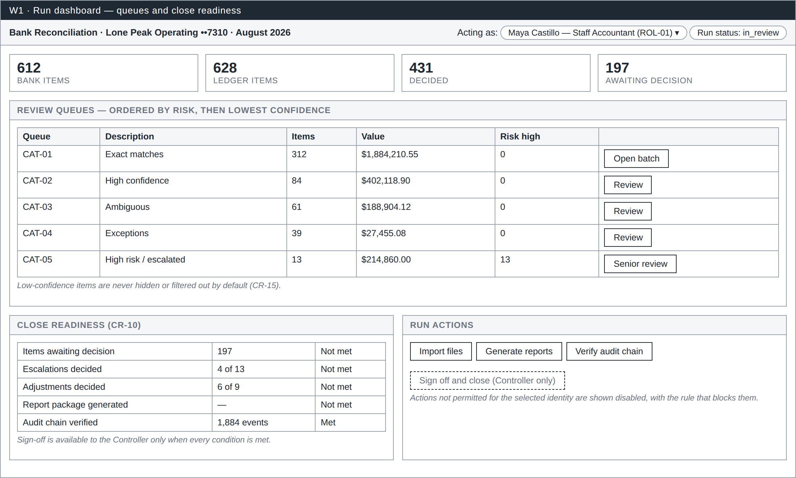
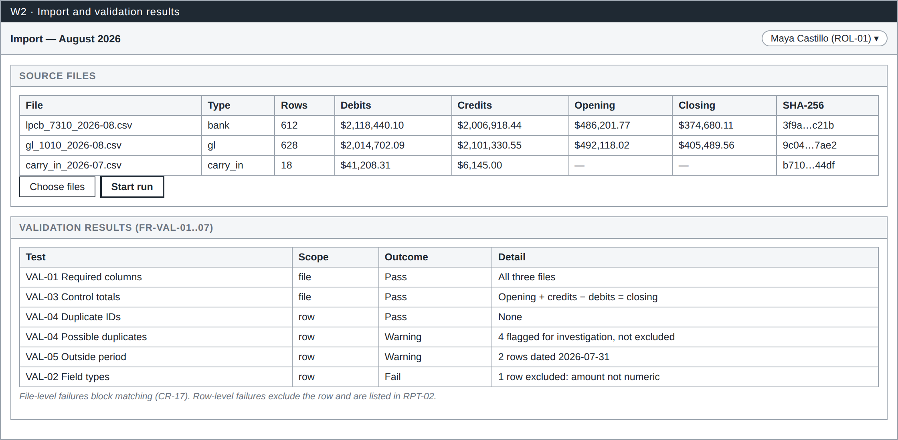
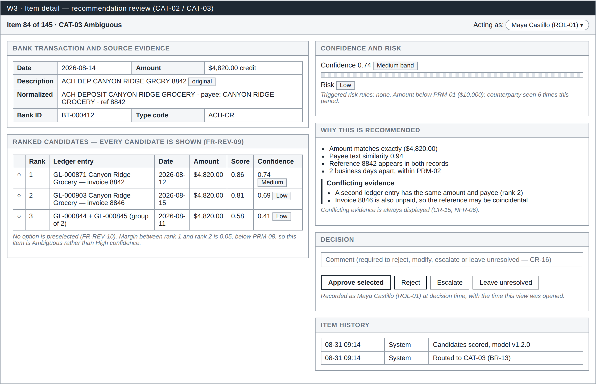
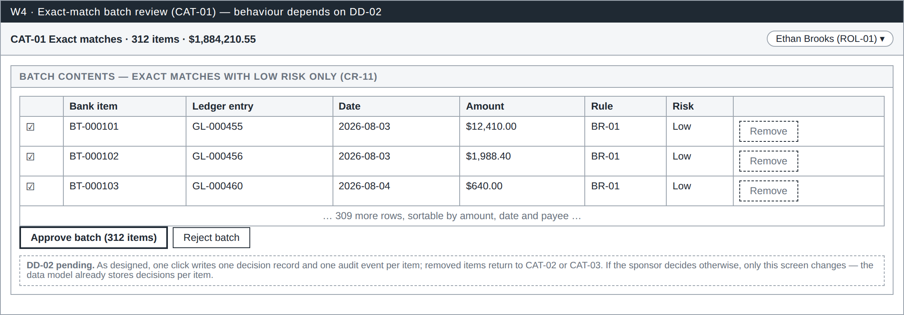
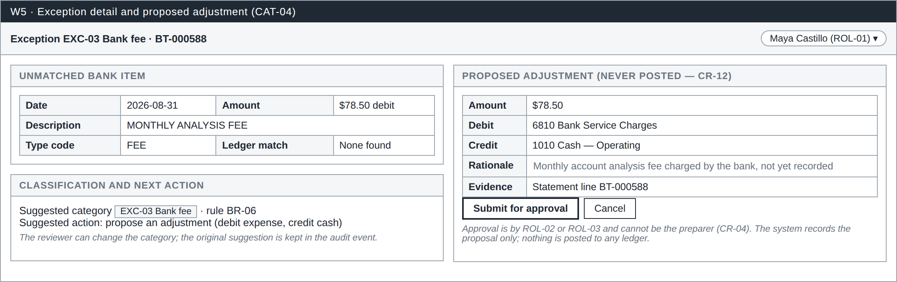
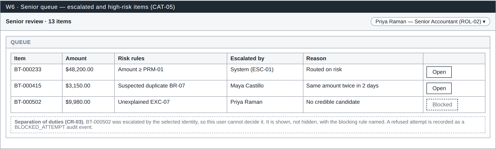
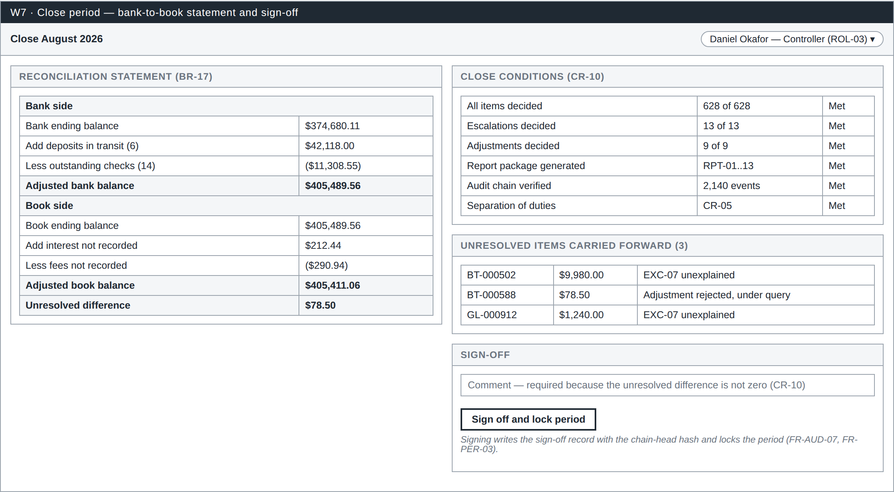
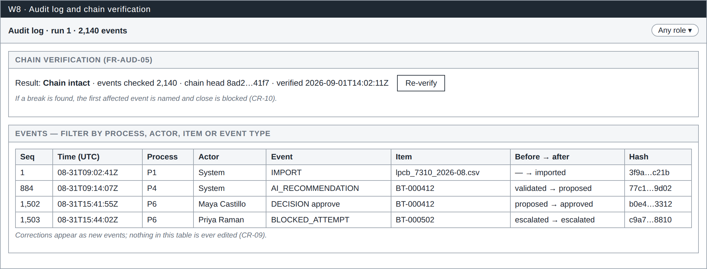

# Reviewer Interface Wireframes

Eight screens cover every element the reviewer interface must provide. Each wireframe is deliberately plain so that review focuses on content, controls and the rules being enforced rather than on visual styling. Rule and requirement IDs refer to DOC-02.

The source file is `docs/diagrams/wireframes.html`, which holds all eight screens and is the file to edit when a screen changes.

## W1 — Run dashboard

{width=6.7in}

The landing screen for a reconciliation run. It shows the identity the user is acting as, the run status, and the size of the job: how many bank and ledger items exist, how many are decided and how many still await a decision.

The five review queues are listed with item counts, total value and the number of high-risk items, so a reviewer can see where the work and the exposure sit before opening anything. Queues are ordered by risk first and lowest confidence second, so the items most likely to be wrong are reached first rather than last.

The close-readiness panel shows each of the close conditions and whether it is met (CR-10). Sign-off is not offered until every condition passes, and actions the selected identity may not perform are shown disabled with the rule that blocks them, rather than hidden.

## W2 — Import and validation

{width=6.7in}

Where a run begins. Three CSV files are imported: the bank statement, the ledger cash detail and the prior period's carry-in items. For each file the screen records row count, debit and credit control totals, opening and closing balances and a SHA-256 hash, which is the evidence trail for the Data Import Report.

The validation panel lists every test performed and its outcome. The distinction matters: a file-level failure blocks matching entirely (CR-17), while a row-level failure excludes only that row and reports it. Possible duplicates and rows dated outside the period are shown as warnings, not exclusions, because they need human judgment rather than automatic removal.

## W3 — Item detail

{width=6.7in}

The core review screen, and the one that carries most of the control design.

The left column shows the bank transaction with both its original and normalized values, then every ranked candidate with its score and confidence. All candidates are listed, not just the best one (FR-REV-09), and no option is preselected (FR-REV-10), so the reviewer must make an actual choice.

The right column explains the recommendation. Confidence appears as both a band and a number, risk shows which rules triggered, and supporting evidence is followed by a separate block of conflicting evidence, which is never hidden (CR-15). The screen also states why the item was classified as Ambiguous rather than High confidence: the margin between the first and second candidate is below the configured threshold.

The decision panel offers approve, reject, escalate and leave-unresolved, with a comment field that is mandatory for anything other than a plain approval (CR-16). The identity in use is recorded with the decision, along with the time the screen was opened, which is what makes time-per-item measurable.

## W4 — Exact-match batch

{width=6.7in}

Exact matches are high volume and low judgment, so they are reviewed as a batch. The batch contains only exact matches with low risk (CR-11); anything large, duplicated or unusual is routed to another queue and can never arrive here.

Each row remains individually visible with its matching rule, and any row can be removed from the batch for individual review. One approval click writes one decision record and one audit event per item, so the effort is batched while the audit trail stays per item.

This screen depends on design decision DD-02, which is awaiting sponsor confirmation. If the decision changes, only this screen changes: the data model already stores decisions individually.

## W5 — Exception and proposed adjustment

{width=6.7in}

Used for items with no counterpart, such as a bank fee that was never recorded in the ledger. The screen shows the unmatched item, the suggested exception category with the rule that produced it, and the recommended next action.

Where an adjustment is appropriate, the form is pre-filled with amount, suggested debit and credit accounts and a rationale, all of which the reviewer can change. The proposal is stored as a record awaiting approval and is never posted to any accounting system (CR-12). Approval must come from a different person than the preparer (CR-04).

## W6 — Senior queue

{width=6.7in}

The queue for escalated and high-risk items. Each row shows the amount, the risk rules that triggered, who escalated the item and why, so the senior reviewer starts with context rather than reconstructing it.

The third row demonstrates separation of duties in action: it was escalated by the identity currently selected, so that user cannot decide it. The item is shown rather than hidden, with the blocking rule named (CR-03), and any refused attempt is recorded as a BLOCKED_ATTEMPT audit event, so control failures leave evidence too.

## W7 — Close period

{width=6.7in}

The Controller's screen. The left panel is the full bank-to-book reconciliation statement: bank ending balance adjusted for deposits in transit and outstanding checks, book ending balance adjusted for unrecorded interest and fees, and the unresolved difference between the two.

The right panel repeats the close conditions with their current state, lists the unresolved items that will be carried forward, and provides sign-off. A comment is required whenever the unresolved difference is not zero, so an unexplained gap cannot be signed away silently. Signing writes the sign-off record together with the chain-head hash of the audit log and locks the period against further change.

## W8 — Audit log and chain verification

{width=6.7in}

The evidence screen, available to every role. Chain verification recomputes each event hash from the event content and the previous hash and reports whether the chain is intact, how many events were checked and the current chain head. A broken chain blocks the period from closing.

The event list shows sequence number, timestamp, process, actor, event type, affected item, the status change and the hash. System and human events sit in the same stream, including refused attempts. Corrections appear as new events; nothing in this list is ever edited or removed (CR-09).
